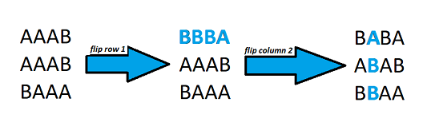

### Flip AB

Given two grids, both with <svg width="1.395ex" height="1.476ex" viewBox="0 -518.7 600.5 635.5" role="img" focusable="false" style="vertical-align: -0.271ex;" aria-hidden="true"><defs><path stroke-width="1" id="E1-MJMATHI-6E" d="M21 287Q22 293 24 303T36 341T56 388T89 425T135 442Q171 442 195 424T225 390T231 369Q231 367 232 367L243 378Q304 442 382 442Q436 442 469 415T503 336T465 179T427 52Q427 26 444 26Q450 26 453 27Q482 32 505 65T540 145Q542 153 560 153Q580 153 580 145Q580 144 576 130Q568 101 554 73T508 17T439 -10Q392 -10 371 17T350 73Q350 92 386 193T423 345Q423 404 379 404H374Q288 404 229 303L222 291L189 157Q156 26 151 16Q138 -11 108 -11Q95 -11 87 -5T76 7T74 17Q74 30 112 180T152 343Q153 348 153 366Q153 405 129 405Q91 405 66 305Q60 285 60 284Q58 278 41 278H27Q21 284 21 287Z"></path></defs><g stroke="currentColor" fill="currentColor" stroke-width="0" transform="matrix(1 0 0 -1 0 0)"><use xlink:href="#E1-MJMATHI-6E" x="0" y="0"></use></g></svg> rows and <svg width="2.04ex" height="1.476ex" viewBox="0 -518.7 878.5 635.5" role="img" focusable="false" style="vertical-align: -0.271ex;" aria-hidden="true"><defs><path stroke-width="1" id="E2-MJMATHI-6D" d="M21 287Q22 293 24 303T36 341T56 388T88 425T132 442T175 435T205 417T221 395T229 376L231 369Q231 367 232 367L243 378Q303 442 384 442Q401 442 415 440T441 433T460 423T475 411T485 398T493 385T497 373T500 364T502 357L510 367Q573 442 659 442Q713 442 746 415T780 336Q780 285 742 178T704 50Q705 36 709 31T724 26Q752 26 776 56T815 138Q818 149 821 151T837 153Q857 153 857 145Q857 144 853 130Q845 101 831 73T785 17T716 -10Q669 -10 648 17T627 73Q627 92 663 193T700 345Q700 404 656 404H651Q565 404 506 303L499 291L466 157Q433 26 428 16Q415 -11 385 -11Q372 -11 364 -4T353 8T350 18Q350 29 384 161L420 307Q423 322 423 345Q423 404 379 404H374Q288 404 229 303L222 291L189 157Q156 26 151 16Q138 -11 108 -11Q95 -11 87 -5T76 7T74 17Q74 30 112 181Q151 335 151 342Q154 357 154 369Q154 405 129 405Q107 405 92 377T69 316T57 280Q55 278 41 278H27Q21 284 21 287Z"></path></defs><g stroke="currentColor" fill="currentColor" stroke-width="0" transform="matrix(1 0 0 -1 0 0)"><use xlink:href="#E2-MJMATHI-6D" x="0" y="0"></use></g></svg> columns, and cells containing either the letter <strong>'A'</strong> or the letter <strong>'B'</strong>. Determine if it is possible to use either of the subsequent operations any number of times, including <svg width="1.162ex" height="2.009ex" viewBox="0 -748.3 500.5 865.1" role="img" focusable="false" style="vertical-align: -0.271ex;" aria-hidden="true"><defs><path stroke-width="1" id="E3-MJMAIN-30" d="M96 585Q152 666 249 666Q297 666 345 640T423 548Q460 465 460 320Q460 165 417 83Q397 41 362 16T301 -15T250 -22Q224 -22 198 -16T137 16T82 83Q39 165 39 320Q39 494 96 585ZM321 597Q291 629 250 629Q208 629 178 597Q153 571 145 525T137 333Q137 175 145 125T181 46Q209 16 250 16Q290 16 318 46Q347 76 354 130T362 333Q362 478 354 524T321 597Z"></path></defs><g stroke="currentColor" fill="currentColor" stroke-width="0" transform="matrix(1 0 0 -1 0 0)"><use xlink:href="#E3-MJMAIN-30" x="0" y="0"></use></g></svg>, to transform the first grid, <svg width="5.23ex" height="2.543ex" viewBox="0 -805.7 2251.9 1094.7" role="img" focusable="false" style="vertical-align: -0.671ex;" aria-hidden="true"><defs><path stroke-width="1" id="E4-MJMATHI-67" d="M311 43Q296 30 267 15T206 0Q143 0 105 45T66 160Q66 265 143 353T314 442Q361 442 401 394L404 398Q406 401 409 404T418 412T431 419T447 422Q461 422 470 413T480 394Q480 379 423 152T363 -80Q345 -134 286 -169T151 -205Q10 -205 10 -137Q10 -111 28 -91T74 -71Q89 -71 102 -80T116 -111Q116 -121 114 -130T107 -144T99 -154T92 -162L90 -164H91Q101 -167 151 -167Q189 -167 211 -155Q234 -144 254 -122T282 -75Q288 -56 298 -13Q311 35 311 43ZM384 328L380 339Q377 350 375 354T369 368T359 382T346 393T328 402T306 405Q262 405 221 352Q191 313 171 233T151 117Q151 38 213 38Q269 38 323 108L331 118L384 328Z"></path><path stroke-width="1" id="E4-MJMATHI-72" d="M21 287Q22 290 23 295T28 317T38 348T53 381T73 411T99 433T132 442Q161 442 183 430T214 408T225 388Q227 382 228 382T236 389Q284 441 347 441H350Q398 441 422 400Q430 381 430 363Q430 333 417 315T391 292T366 288Q346 288 334 299T322 328Q322 376 378 392Q356 405 342 405Q286 405 239 331Q229 315 224 298T190 165Q156 25 151 16Q138 -11 108 -11Q95 -11 87 -5T76 7T74 17Q74 30 114 189T154 366Q154 405 128 405Q107 405 92 377T68 316T57 280Q55 278 41 278H27Q21 284 21 287Z"></path><path stroke-width="1" id="E4-MJMATHI-69" d="M184 600Q184 624 203 642T247 661Q265 661 277 649T290 619Q290 596 270 577T226 557Q211 557 198 567T184 600ZM21 287Q21 295 30 318T54 369T98 420T158 442Q197 442 223 419T250 357Q250 340 236 301T196 196T154 83Q149 61 149 51Q149 26 166 26Q175 26 185 29T208 43T235 78T260 137Q263 149 265 151T282 153Q302 153 302 143Q302 135 293 112T268 61T223 11T161 -11Q129 -11 102 10T74 74Q74 91 79 106T122 220Q160 321 166 341T173 380Q173 404 156 404H154Q124 404 99 371T61 287Q60 286 59 284T58 281T56 279T53 278T49 278T41 278H27Q21 284 21 287Z"></path><path stroke-width="1" id="E4-MJMATHI-64" d="M366 683Q367 683 438 688T511 694Q523 694 523 686Q523 679 450 384T375 83T374 68Q374 26 402 26Q411 27 422 35Q443 55 463 131Q469 151 473 152Q475 153 483 153H487H491Q506 153 506 145Q506 140 503 129Q490 79 473 48T445 8T417 -8Q409 -10 393 -10Q359 -10 336 5T306 36L300 51Q299 52 296 50Q294 48 292 46Q233 -10 172 -10Q117 -10 75 30T33 157Q33 205 53 255T101 341Q148 398 195 420T280 442Q336 442 364 400Q369 394 369 396Q370 400 396 505T424 616Q424 629 417 632T378 637H357Q351 643 351 645T353 664Q358 683 366 683ZM352 326Q329 405 277 405Q242 405 210 374T160 293Q131 214 119 129Q119 126 119 118T118 106Q118 61 136 44T179 26Q233 26 290 98L298 109L352 326Z"></path><path stroke-width="1" id="E4-MJMAIN-31" d="M213 578L200 573Q186 568 160 563T102 556H83V602H102Q149 604 189 617T245 641T273 663Q275 666 285 666Q294 666 302 660V361L303 61Q310 54 315 52T339 48T401 46H427V0H416Q395 3 257 3Q121 3 100 0H88V46H114Q136 46 152 46T177 47T193 50T201 52T207 57T213 61V578Z"></path></defs><g stroke="currentColor" fill="currentColor" stroke-width="0" transform="matrix(1 0 0 -1 0 0)"><use xlink:href="#E4-MJMATHI-67" x="0" y="0"></use><use xlink:href="#E4-MJMATHI-72" x="480" y="0"></use><use xlink:href="#E4-MJMATHI-69" x="932" y="0"></use><g transform="translate(1277,0)"><use xlink:href="#E4-MJMATHI-64" x="0" y="0"></use><use transform="scale(0.707)" xlink:href="#E4-MJMAIN-31" x="736" y="-213"></use></g></g></svg>, to the second grid, <svg width="5.23ex" height="2.543ex" viewBox="0 -805.7 2251.9 1094.7" role="img" focusable="false" style="vertical-align: -0.671ex;" aria-hidden="true"><defs><path stroke-width="1" id="E5-MJMATHI-67" d="M311 43Q296 30 267 15T206 0Q143 0 105 45T66 160Q66 265 143 353T314 442Q361 442 401 394L404 398Q406 401 409 404T418 412T431 419T447 422Q461 422 470 413T480 394Q480 379 423 152T363 -80Q345 -134 286 -169T151 -205Q10 -205 10 -137Q10 -111 28 -91T74 -71Q89 -71 102 -80T116 -111Q116 -121 114 -130T107 -144T99 -154T92 -162L90 -164H91Q101 -167 151 -167Q189 -167 211 -155Q234 -144 254 -122T282 -75Q288 -56 298 -13Q311 35 311 43ZM384 328L380 339Q377 350 375 354T369 368T359 382T346 393T328 402T306 405Q262 405 221 352Q191 313 171 233T151 117Q151 38 213 38Q269 38 323 108L331 118L384 328Z"></path><path stroke-width="1" id="E5-MJMATHI-72" d="M21 287Q22 290 23 295T28 317T38 348T53 381T73 411T99 433T132 442Q161 442 183 430T214 408T225 388Q227 382 228 382T236 389Q284 441 347 441H350Q398 441 422 400Q430 381 430 363Q430 333 417 315T391 292T366 288Q346 288 334 299T322 328Q322 376 378 392Q356 405 342 405Q286 405 239 331Q229 315 224 298T190 165Q156 25 151 16Q138 -11 108 -11Q95 -11 87 -5T76 7T74 17Q74 30 114 189T154 366Q154 405 128 405Q107 405 92 377T68 316T57 280Q55 278 41 278H27Q21 284 21 287Z"></path><path stroke-width="1" id="E5-MJMATHI-69" d="M184 600Q184 624 203 642T247 661Q265 661 277 649T290 619Q290 596 270 577T226 557Q211 557 198 567T184 600ZM21 287Q21 295 30 318T54 369T98 420T158 442Q197 442 223 419T250 357Q250 340 236 301T196 196T154 83Q149 61 149 51Q149 26 166 26Q175 26 185 29T208 43T235 78T260 137Q263 149 265 151T282 153Q302 153 302 143Q302 135 293 112T268 61T223 11T161 -11Q129 -11 102 10T74 74Q74 91 79 106T122 220Q160 321 166 341T173 380Q173 404 156 404H154Q124 404 99 371T61 287Q60 286 59 284T58 281T56 279T53 278T49 278T41 278H27Q21 284 21 287Z"></path><path stroke-width="1" id="E5-MJMATHI-64" d="M366 683Q367 683 438 688T511 694Q523 694 523 686Q523 679 450 384T375 83T374 68Q374 26 402 26Q411 27 422 35Q443 55 463 131Q469 151 473 152Q475 153 483 153H487H491Q506 153 506 145Q506 140 503 129Q490 79 473 48T445 8T417 -8Q409 -10 393 -10Q359 -10 336 5T306 36L300 51Q299 52 296 50Q294 48 292 46Q233 -10 172 -10Q117 -10 75 30T33 157Q33 205 53 255T101 341Q148 398 195 420T280 442Q336 442 364 400Q369 394 369 396Q370 400 396 505T424 616Q424 629 417 632T378 637H357Q351 643 351 645T353 664Q358 683 366 683ZM352 326Q329 405 277 405Q242 405 210 374T160 293Q131 214 119 129Q119 126 119 118T118 106Q118 61 136 44T179 26Q233 26 290 98L298 109L352 326Z"></path><path stroke-width="1" id="E5-MJMAIN-32" d="M109 429Q82 429 66 447T50 491Q50 562 103 614T235 666Q326 666 387 610T449 465Q449 422 429 383T381 315T301 241Q265 210 201 149L142 93L218 92Q375 92 385 97Q392 99 409 186V189H449V186Q448 183 436 95T421 3V0H50V19V31Q50 38 56 46T86 81Q115 113 136 137Q145 147 170 174T204 211T233 244T261 278T284 308T305 340T320 369T333 401T340 431T343 464Q343 527 309 573T212 619Q179 619 154 602T119 569T109 550Q109 549 114 549Q132 549 151 535T170 489Q170 464 154 447T109 429Z"></path></defs><g stroke="currentColor" fill="currentColor" stroke-width="0" transform="matrix(1 0 0 -1 0 0)"><use xlink:href="#E5-MJMATHI-67" x="0" y="0"></use><use xlink:href="#E5-MJMATHI-72" x="480" y="0"></use><use xlink:href="#E5-MJMATHI-69" x="932" y="0"></use><g transform="translate(1277,0)"><use xlink:href="#E5-MJMATHI-64" x="0" y="0"></use><use transform="scale(0.707)" xlink:href="#E5-MJMAIN-32" x="736" y="-213"></use></g></g></svg>:

<ul>
	<li><strong>ROW FLIP:</strong> In this operation, you choose a row in <svg width="5.23ex" height="2.543ex" viewBox="0 -805.7 2251.9 1094.7" role="img" focusable="false" style="vertical-align: -0.671ex;" aria-hidden="true"><defs><path stroke-width="1" id="E6-MJMATHI-67" d="M311 43Q296 30 267 15T206 0Q143 0 105 45T66 160Q66 265 143 353T314 442Q361 442 401 394L404 398Q406 401 409 404T418 412T431 419T447 422Q461 422 470 413T480 394Q480 379 423 152T363 -80Q345 -134 286 -169T151 -205Q10 -205 10 -137Q10 -111 28 -91T74 -71Q89 -71 102 -80T116 -111Q116 -121 114 -130T107 -144T99 -154T92 -162L90 -164H91Q101 -167 151 -167Q189 -167 211 -155Q234 -144 254 -122T282 -75Q288 -56 298 -13Q311 35 311 43ZM384 328L380 339Q377 350 375 354T369 368T359 382T346 393T328 402T306 405Q262 405 221 352Q191 313 171 233T151 117Q151 38 213 38Q269 38 323 108L331 118L384 328Z"></path><path stroke-width="1" id="E6-MJMATHI-72" d="M21 287Q22 290 23 295T28 317T38 348T53 381T73 411T99 433T132 442Q161 442 183 430T214 408T225 388Q227 382 228 382T236 389Q284 441 347 441H350Q398 441 422 400Q430 381 430 363Q430 333 417 315T391 292T366 288Q346 288 334 299T322 328Q322 376 378 392Q356 405 342 405Q286 405 239 331Q229 315 224 298T190 165Q156 25 151 16Q138 -11 108 -11Q95 -11 87 -5T76 7T74 17Q74 30 114 189T154 366Q154 405 128 405Q107 405 92 377T68 316T57 280Q55 278 41 278H27Q21 284 21 287Z"></path><path stroke-width="1" id="E6-MJMATHI-69" d="M184 600Q184 624 203 642T247 661Q265 661 277 649T290 619Q290 596 270 577T226 557Q211 557 198 567T184 600ZM21 287Q21 295 30 318T54 369T98 420T158 442Q197 442 223 419T250 357Q250 340 236 301T196 196T154 83Q149 61 149 51Q149 26 166 26Q175 26 185 29T208 43T235 78T260 137Q263 149 265 151T282 153Q302 153 302 143Q302 135 293 112T268 61T223 11T161 -11Q129 -11 102 10T74 74Q74 91 79 106T122 220Q160 321 166 341T173 380Q173 404 156 404H154Q124 404 99 371T61 287Q60 286 59 284T58 281T56 279T53 278T49 278T41 278H27Q21 284 21 287Z"></path><path stroke-width="1" id="E6-MJMATHI-64" d="M366 683Q367 683 438 688T511 694Q523 694 523 686Q523 679 450 384T375 83T374 68Q374 26 402 26Q411 27 422 35Q443 55 463 131Q469 151 473 152Q475 153 483 153H487H491Q506 153 506 145Q506 140 503 129Q490 79 473 48T445 8T417 -8Q409 -10 393 -10Q359 -10 336 5T306 36L300 51Q299 52 296 50Q294 48 292 46Q233 -10 172 -10Q117 -10 75 30T33 157Q33 205 53 255T101 341Q148 398 195 420T280 442Q336 442 364 400Q369 394 369 396Q370 400 396 505T424 616Q424 629 417 632T378 637H357Q351 643 351 645T353 664Q358 683 366 683ZM352 326Q329 405 277 405Q242 405 210 374T160 293Q131 214 119 129Q119 126 119 118T118 106Q118 61 136 44T179 26Q233 26 290 98L298 109L352 326Z"></path><path stroke-width="1" id="E6-MJMAIN-31" d="M213 578L200 573Q186 568 160 563T102 556H83V602H102Q149 604 189 617T245 641T273 663Q275 666 285 666Q294 666 302 660V361L303 61Q310 54 315 52T339 48T401 46H427V0H416Q395 3 257 3Q121 3 100 0H88V46H114Q136 46 152 46T177 47T193 50T201 52T207 57T213 61V578Z"></path></defs><g stroke="currentColor" fill="currentColor" stroke-width="0" transform="matrix(1 0 0 -1 0 0)"><use xlink:href="#E6-MJMATHI-67" x="0" y="0"></use><use xlink:href="#E6-MJMATHI-72" x="480" y="0"></use><use xlink:href="#E6-MJMATHI-69" x="932" y="0"></use><g transform="translate(1277,0)"><use xlink:href="#E6-MJMATHI-64" x="0" y="0"></use><use transform="scale(0.707)" xlink:href="#E6-MJMAIN-31" x="736" y="-213"></use></g></g></svg> and <strong>flip</strong> all the characters in the chosen row.</li>
	<li><strong>COLUMN FLIP:</strong> In this operation, you choose a column in <svg width="5.23ex" height="2.543ex" viewBox="0 -805.7 2251.9 1094.7" role="img" focusable="false" style="vertical-align: -0.671ex;" aria-hidden="true"><defs><path stroke-width="1" id="E7-MJMATHI-67" d="M311 43Q296 30 267 15T206 0Q143 0 105 45T66 160Q66 265 143 353T314 442Q361 442 401 394L404 398Q406 401 409 404T418 412T431 419T447 422Q461 422 470 413T480 394Q480 379 423 152T363 -80Q345 -134 286 -169T151 -205Q10 -205 10 -137Q10 -111 28 -91T74 -71Q89 -71 102 -80T116 -111Q116 -121 114 -130T107 -144T99 -154T92 -162L90 -164H91Q101 -167 151 -167Q189 -167 211 -155Q234 -144 254 -122T282 -75Q288 -56 298 -13Q311 35 311 43ZM384 328L380 339Q377 350 375 354T369 368T359 382T346 393T328 402T306 405Q262 405 221 352Q191 313 171 233T151 117Q151 38 213 38Q269 38 323 108L331 118L384 328Z"></path><path stroke-width="1" id="E7-MJMATHI-72" d="M21 287Q22 290 23 295T28 317T38 348T53 381T73 411T99 433T132 442Q161 442 183 430T214 408T225 388Q227 382 228 382T236 389Q284 441 347 441H350Q398 441 422 400Q430 381 430 363Q430 333 417 315T391 292T366 288Q346 288 334 299T322 328Q322 376 378 392Q356 405 342 405Q286 405 239 331Q229 315 224 298T190 165Q156 25 151 16Q138 -11 108 -11Q95 -11 87 -5T76 7T74 17Q74 30 114 189T154 366Q154 405 128 405Q107 405 92 377T68 316T57 280Q55 278 41 278H27Q21 284 21 287Z"></path><path stroke-width="1" id="E7-MJMATHI-69" d="M184 600Q184 624 203 642T247 661Q265 661 277 649T290 619Q290 596 270 577T226 557Q211 557 198 567T184 600ZM21 287Q21 295 30 318T54 369T98 420T158 442Q197 442 223 419T250 357Q250 340 236 301T196 196T154 83Q149 61 149 51Q149 26 166 26Q175 26 185 29T208 43T235 78T260 137Q263 149 265 151T282 153Q302 153 302 143Q302 135 293 112T268 61T223 11T161 -11Q129 -11 102 10T74 74Q74 91 79 106T122 220Q160 321 166 341T173 380Q173 404 156 404H154Q124 404 99 371T61 287Q60 286 59 284T58 281T56 279T53 278T49 278T41 278H27Q21 284 21 287Z"></path><path stroke-width="1" id="E7-MJMATHI-64" d="M366 683Q367 683 438 688T511 694Q523 694 523 686Q523 679 450 384T375 83T374 68Q374 26 402 26Q411 27 422 35Q443 55 463 131Q469 151 473 152Q475 153 483 153H487H491Q506 153 506 145Q506 140 503 129Q490 79 473 48T445 8T417 -8Q409 -10 393 -10Q359 -10 336 5T306 36L300 51Q299 52 296 50Q294 48 292 46Q233 -10 172 -10Q117 -10 75 30T33 157Q33 205 53 255T101 341Q148 398 195 420T280 442Q336 442 364 400Q369 394 369 396Q370 400 396 505T424 616Q424 629 417 632T378 637H357Q351 643 351 645T353 664Q358 683 366 683ZM352 326Q329 405 277 405Q242 405 210 374T160 293Q131 214 119 129Q119 126 119 118T118 106Q118 61 136 44T179 26Q233 26 290 98L298 109L352 326Z"></path><path stroke-width="1" id="E7-MJMAIN-31" d="M213 578L200 573Q186 568 160 563T102 556H83V602H102Q149 604 189 617T245 641T273 663Q275 666 285 666Q294 666 302 660V361L303 61Q310 54 315 52T339 48T401 46H427V0H416Q395 3 257 3Q121 3 100 0H88V46H114Q136 46 152 46T177 47T193 50T201 52T207 57T213 61V578Z"></path></defs><g stroke="currentColor" fill="currentColor" stroke-width="0" transform="matrix(1 0 0 -1 0 0)"><use xlink:href="#E7-MJMATHI-67" x="0" y="0"></use><use xlink:href="#E7-MJMATHI-72" x="480" y="0"></use><use xlink:href="#E7-MJMATHI-69" x="932" y="0"></use><g transform="translate(1277,0)"><use xlink:href="#E7-MJMATHI-64" x="0" y="0"></use><use transform="scale(0.707)" xlink:href="#E7-MJMAIN-31" x="736" y="-213"></use></g></g></svg> and <strong>flip</strong> all the characters in the chosen column.</li>
</ul>

A <strong>flip</strong> changes the letter <strong>'A'</strong> to letter <strong>'B'</strong>, and vice-versa.

Your program should output <strong>"YES" (without quotes)</strong> if it is possible to convert <svg width="5.23ex" height="2.543ex" viewBox="0 -805.7 2251.9 1094.7" role="img" focusable="false" style="vertical-align: -0.671ex;" aria-hidden="true"><defs><path stroke-width="1" id="E8-MJMATHI-67" d="M311 43Q296 30 267 15T206 0Q143 0 105 45T66 160Q66 265 143 353T314 442Q361 442 401 394L404 398Q406 401 409 404T418 412T431 419T447 422Q461 422 470 413T480 394Q480 379 423 152T363 -80Q345 -134 286 -169T151 -205Q10 -205 10 -137Q10 -111 28 -91T74 -71Q89 -71 102 -80T116 -111Q116 -121 114 -130T107 -144T99 -154T92 -162L90 -164H91Q101 -167 151 -167Q189 -167 211 -155Q234 -144 254 -122T282 -75Q288 -56 298 -13Q311 35 311 43ZM384 328L380 339Q377 350 375 354T369 368T359 382T346 393T328 402T306 405Q262 405 221 352Q191 313 171 233T151 117Q151 38 213 38Q269 38 323 108L331 118L384 328Z"></path><path stroke-width="1" id="E8-MJMATHI-72" d="M21 287Q22 290 23 295T28 317T38 348T53 381T73 411T99 433T132 442Q161 442 183 430T214 408T225 388Q227 382 228 382T236 389Q284 441 347 441H350Q398 441 422 400Q430 381 430 363Q430 333 417 315T391 292T366 288Q346 288 334 299T322 328Q322 376 378 392Q356 405 342 405Q286 405 239 331Q229 315 224 298T190 165Q156 25 151 16Q138 -11 108 -11Q95 -11 87 -5T76 7T74 17Q74 30 114 189T154 366Q154 405 128 405Q107 405 92 377T68 316T57 280Q55 278 41 278H27Q21 284 21 287Z"></path><path stroke-width="1" id="E8-MJMATHI-69" d="M184 600Q184 624 203 642T247 661Q265 661 277 649T290 619Q290 596 270 577T226 557Q211 557 198 567T184 600ZM21 287Q21 295 30 318T54 369T98 420T158 442Q197 442 223 419T250 357Q250 340 236 301T196 196T154 83Q149 61 149 51Q149 26 166 26Q175 26 185 29T208 43T235 78T260 137Q263 149 265 151T282 153Q302 153 302 143Q302 135 293 112T268 61T223 11T161 -11Q129 -11 102 10T74 74Q74 91 79 106T122 220Q160 321 166 341T173 380Q173 404 156 404H154Q124 404 99 371T61 287Q60 286 59 284T58 281T56 279T53 278T49 278T41 278H27Q21 284 21 287Z"></path><path stroke-width="1" id="E8-MJMATHI-64" d="M366 683Q367 683 438 688T511 694Q523 694 523 686Q523 679 450 384T375 83T374 68Q374 26 402 26Q411 27 422 35Q443 55 463 131Q469 151 473 152Q475 153 483 153H487H491Q506 153 506 145Q506 140 503 129Q490 79 473 48T445 8T417 -8Q409 -10 393 -10Q359 -10 336 5T306 36L300 51Q299 52 296 50Q294 48 292 46Q233 -10 172 -10Q117 -10 75 30T33 157Q33 205 53 255T101 341Q148 398 195 420T280 442Q336 442 364 400Q369 394 369 396Q370 400 396 505T424 616Q424 629 417 632T378 637H357Q351 643 351 645T353 664Q358 683 366 683ZM352 326Q329 405 277 405Q242 405 210 374T160 293Q131 214 119 129Q119 126 119 118T118 106Q118 61 136 44T179 26Q233 26 290 98L298 109L352 326Z"></path><path stroke-width="1" id="E8-MJMAIN-31" d="M213 578L200 573Q186 568 160 563T102 556H83V602H102Q149 604 189 617T245 641T273 663Q275 666 285 666Q294 666 302 660V361L303 61Q310 54 315 52T339 48T401 46H427V0H416Q395 3 257 3Q121 3 100 0H88V46H114Q136 46 152 46T177 47T193 50T201 52T207 57T213 61V578Z"></path></defs><g stroke="currentColor" fill="currentColor" stroke-width="0" transform="matrix(1 0 0 -1 0 0)"><use xlink:href="#E8-MJMATHI-67" x="0" y="0"></use><use xlink:href="#E8-MJMATHI-72" x="480" y="0"></use><use xlink:href="#E8-MJMATHI-69" x="932" y="0"></use><g transform="translate(1277,0)"><use xlink:href="#E8-MJMATHI-64" x="0" y="0"></use><use transform="scale(0.707)" xlink:href="#E8-MJMAIN-31" x="736" y="-213"></use></g></g></svg> to <svg width="5.23ex" height="2.543ex" viewBox="0 -805.7 2251.9 1094.7" role="img" focusable="false" style="vertical-align: -0.671ex;" aria-hidden="true"><defs><path stroke-width="1" id="E9-MJMATHI-67" d="M311 43Q296 30 267 15T206 0Q143 0 105 45T66 160Q66 265 143 353T314 442Q361 442 401 394L404 398Q406 401 409 404T418 412T431 419T447 422Q461 422 470 413T480 394Q480 379 423 152T363 -80Q345 -134 286 -169T151 -205Q10 -205 10 -137Q10 -111 28 -91T74 -71Q89 -71 102 -80T116 -111Q116 -121 114 -130T107 -144T99 -154T92 -162L90 -164H91Q101 -167 151 -167Q189 -167 211 -155Q234 -144 254 -122T282 -75Q288 -56 298 -13Q311 35 311 43ZM384 328L380 339Q377 350 375 354T369 368T359 382T346 393T328 402T306 405Q262 405 221 352Q191 313 171 233T151 117Q151 38 213 38Q269 38 323 108L331 118L384 328Z"></path><path stroke-width="1" id="E9-MJMATHI-72" d="M21 287Q22 290 23 295T28 317T38 348T53 381T73 411T99 433T132 442Q161 442 183 430T214 408T225 388Q227 382 228 382T236 389Q284 441 347 441H350Q398 441 422 400Q430 381 430 363Q430 333 417 315T391 292T366 288Q346 288 334 299T322 328Q322 376 378 392Q356 405 342 405Q286 405 239 331Q229 315 224 298T190 165Q156 25 151 16Q138 -11 108 -11Q95 -11 87 -5T76 7T74 17Q74 30 114 189T154 366Q154 405 128 405Q107 405 92 377T68 316T57 280Q55 278 41 278H27Q21 284 21 287Z"></path><path stroke-width="1" id="E9-MJMATHI-69" d="M184 600Q184 624 203 642T247 661Q265 661 277 649T290 619Q290 596 270 577T226 557Q211 557 198 567T184 600ZM21 287Q21 295 30 318T54 369T98 420T158 442Q197 442 223 419T250 357Q250 340 236 301T196 196T154 83Q149 61 149 51Q149 26 166 26Q175 26 185 29T208 43T235 78T260 137Q263 149 265 151T282 153Q302 153 302 143Q302 135 293 112T268 61T223 11T161 -11Q129 -11 102 10T74 74Q74 91 79 106T122 220Q160 321 166 341T173 380Q173 404 156 404H154Q124 404 99 371T61 287Q60 286 59 284T58 281T56 279T53 278T49 278T41 278H27Q21 284 21 287Z"></path><path stroke-width="1" id="E9-MJMATHI-64" d="M366 683Q367 683 438 688T511 694Q523 694 523 686Q523 679 450 384T375 83T374 68Q374 26 402 26Q411 27 422 35Q443 55 463 131Q469 151 473 152Q475 153 483 153H487H491Q506 153 506 145Q506 140 503 129Q490 79 473 48T445 8T417 -8Q409 -10 393 -10Q359 -10 336 5T306 36L300 51Q299 52 296 50Q294 48 292 46Q233 -10 172 -10Q117 -10 75 30T33 157Q33 205 53 255T101 341Q148 398 195 420T280 442Q336 442 364 400Q369 394 369 396Q370 400 396 505T424 616Q424 629 417 632T378 637H357Q351 643 351 645T353 664Q358 683 366 683ZM352 326Q329 405 277 405Q242 405 210 374T160 293Q131 214 119 129Q119 126 119 118T118 106Q118 61 136 44T179 26Q233 26 290 98L298 109L352 326Z"></path><path stroke-width="1" id="E9-MJMAIN-32" d="M109 429Q82 429 66 447T50 491Q50 562 103 614T235 666Q326 666 387 610T449 465Q449 422 429 383T381 315T301 241Q265 210 201 149L142 93L218 92Q375 92 385 97Q392 99 409 186V189H449V186Q448 183 436 95T421 3V0H50V19V31Q50 38 56 46T86 81Q115 113 136 137Q145 147 170 174T204 211T233 244T261 278T284 308T305 340T320 369T333 401T340 431T343 464Q343 527 309 573T212 619Q179 619 154 602T119 569T109 550Q109 549 114 549Q132 549 151 535T170 489Q170 464 154 447T109 429Z"></path></defs><g stroke="currentColor" fill="currentColor" stroke-width="0" transform="matrix(1 0 0 -1 0 0)"><use xlink:href="#E9-MJMATHI-67" x="0" y="0"></use><use xlink:href="#E9-MJMATHI-72" x="480" y="0"></use><use xlink:href="#E9-MJMATHI-69" x="932" y="0"></use><g transform="translate(1277,0)"><use xlink:href="#E9-MJMATHI-64" x="0" y="0"></use><use transform="scale(0.707)" xlink:href="#E9-MJMAIN-32" x="736" y="-213"></use></g></g></svg>, and <strong>"NO"</strong> <strong>(without quotes)</strong> otherwise.

<strong>NOTE:</strong> <strong>You can perform the operations on <svg width="5.23ex" height="2.543ex" viewBox="0 -805.7 2251.9 1094.7" role="img" focusable="false" style="vertical-align: -0.671ex;" aria-hidden="true"><defs><path stroke-width="1" id="E10-MJMATHI-67" d="M311 43Q296 30 267 15T206 0Q143 0 105 45T66 160Q66 265 143 353T314 442Q361 442 401 394L404 398Q406 401 409 404T418 412T431 419T447 422Q461 422 470 413T480 394Q480 379 423 152T363 -80Q345 -134 286 -169T151 -205Q10 -205 10 -137Q10 -111 28 -91T74 -71Q89 -71 102 -80T116 -111Q116 -121 114 -130T107 -144T99 -154T92 -162L90 -164H91Q101 -167 151 -167Q189 -167 211 -155Q234 -144 254 -122T282 -75Q288 -56 298 -13Q311 35 311 43ZM384 328L380 339Q377 350 375 354T369 368T359 382T346 393T328 402T306 405Q262 405 221 352Q191 313 171 233T151 117Q151 38 213 38Q269 38 323 108L331 118L384 328Z"></path><path stroke-width="1" id="E10-MJMATHI-72" d="M21 287Q22 290 23 295T28 317T38 348T53 381T73 411T99 433T132 442Q161 442 183 430T214 408T225 388Q227 382 228 382T236 389Q284 441 347 441H350Q398 441 422 400Q430 381 430 363Q430 333 417 315T391 292T366 288Q346 288 334 299T322 328Q322 376 378 392Q356 405 342 405Q286 405 239 331Q229 315 224 298T190 165Q156 25 151 16Q138 -11 108 -11Q95 -11 87 -5T76 7T74 17Q74 30 114 189T154 366Q154 405 128 405Q107 405 92 377T68 316T57 280Q55 278 41 278H27Q21 284 21 287Z"></path><path stroke-width="1" id="E10-MJMATHI-69" d="M184 600Q184 624 203 642T247 661Q265 661 277 649T290 619Q290 596 270 577T226 557Q211 557 198 567T184 600ZM21 287Q21 295 30 318T54 369T98 420T158 442Q197 442 223 419T250 357Q250 340 236 301T196 196T154 83Q149 61 149 51Q149 26 166 26Q175 26 185 29T208 43T235 78T260 137Q263 149 265 151T282 153Q302 153 302 143Q302 135 293 112T268 61T223 11T161 -11Q129 -11 102 10T74 74Q74 91 79 106T122 220Q160 321 166 341T173 380Q173 404 156 404H154Q124 404 99 371T61 287Q60 286 59 284T58 281T56 279T53 278T49 278T41 278H27Q21 284 21 287Z"></path><path stroke-width="1" id="E10-MJMATHI-64" d="M366 683Q367 683 438 688T511 694Q523 694 523 686Q523 679 450 384T375 83T374 68Q374 26 402 26Q411 27 422 35Q443 55 463 131Q469 151 473 152Q475 153 483 153H487H491Q506 153 506 145Q506 140 503 129Q490 79 473 48T445 8T417 -8Q409 -10 393 -10Q359 -10 336 5T306 36L300 51Q299 52 296 50Q294 48 292 46Q233 -10 172 -10Q117 -10 75 30T33 157Q33 205 53 255T101 341Q148 398 195 420T280 442Q336 442 364 400Q369 394 369 396Q370 400 396 505T424 616Q424 629 417 632T378 637H357Q351 643 351 645T353 664Q358 683 366 683ZM352 326Q329 405 277 405Q242 405 210 374T160 293Q131 214 119 129Q119 126 119 118T118 106Q118 61 136 44T179 26Q233 26 290 98L298 109L352 326Z"></path><path stroke-width="1" id="E10-MJMAIN-31" d="M213 578L200 573Q186 568 160 563T102 556H83V602H102Q149 604 189 617T245 641T273 663Q275 666 285 666Q294 666 302 660V361L303 61Q310 54 315 52T339 48T401 46H427V0H416Q395 3 257 3Q121 3 100 0H88V46H114Q136 46 152 46T177 47T193 50T201 52T207 57T213 61V578Z"></path></defs><g stroke="currentColor" fill="currentColor" stroke-width="0" transform="matrix(1 0 0 -1 0 0)"><use xlink:href="#E10-MJMATHI-67" x="0" y="0"></use><use xlink:href="#E10-MJMATHI-72" x="480" y="0"></use><use xlink:href="#E10-MJMATHI-69" x="932" y="0"></use><g transform="translate(1277,0)"><use xlink:href="#E10-MJMATHI-64" x="0" y="0"></use><use transform="scale(0.707)" xlink:href="#E10-MJMAIN-31" x="736" y="-213"></use></g></g></svg> only.</strong>

<strong>INPUT FORMAT</strong>

The first line contains an integer, <svg width="0.84ex" height="1.876ex" viewBox="0 -690.9 361.5 807.7" role="img" focusable="false" style="vertical-align: -0.271ex;" aria-hidden="true"><defs><path stroke-width="1" id="E11-MJMATHI-74" d="M26 385Q19 392 19 395Q19 399 22 411T27 425Q29 430 36 430T87 431H140L159 511Q162 522 166 540T173 566T179 586T187 603T197 615T211 624T229 626Q247 625 254 615T261 596Q261 589 252 549T232 470L222 433Q222 431 272 431H323Q330 424 330 420Q330 398 317 385H210L174 240Q135 80 135 68Q135 26 162 26Q197 26 230 60T283 144Q285 150 288 151T303 153H307Q322 153 322 145Q322 142 319 133Q314 117 301 95T267 48T216 6T155 -11Q125 -11 98 4T59 56Q57 64 57 83V101L92 241Q127 382 128 383Q128 385 77 385H26Z"></path></defs><g stroke="currentColor" fill="currentColor" stroke-width="0" transform="matrix(1 0 0 -1 0 0)"><use xlink:href="#E11-MJMATHI-74" x="0" y="0"></use></g></svg><svg width="17.004ex" height="3.076ex" viewBox="0 -977.9 7321 1324.4" role="img" focusable="false" style="vertical-align: -0.805ex;" aria-hidden="true"><defs><path stroke-width="1" id="E12-MJMAIN-28" d="M94 250Q94 319 104 381T127 488T164 576T202 643T244 695T277 729T302 750H315H319Q333 750 333 741Q333 738 316 720T275 667T226 581T184 443T167 250T184 58T225 -81T274 -167T316 -220T333 -241Q333 -250 318 -250H315H302L274 -226Q180 -141 137 -14T94 250Z"></path><path stroke-width="1" id="E12-MJMAIN-31" d="M213 578L200 573Q186 568 160 563T102 556H83V602H102Q149 604 189 617T245 641T273 663Q275 666 285 666Q294 666 302 660V361L303 61Q310 54 315 52T339 48T401 46H427V0H416Q395 3 257 3Q121 3 100 0H88V46H114Q136 46 152 46T177 47T193 50T201 52T207 57T213 61V578Z"></path><path stroke-width="1" id="E12-MJMAIN-3C" d="M694 -11T694 -19T688 -33T678 -40Q671 -40 524 29T234 166L90 235Q83 240 83 250Q83 261 91 266Q664 540 678 540Q681 540 687 534T694 519T687 505Q686 504 417 376L151 250L417 124Q686 -4 687 -5Q694 -11 694 -19Z"></path><path stroke-width="1" id="E12-MJMAIN-3D" d="M56 347Q56 360 70 367H707Q722 359 722 347Q722 336 708 328L390 327H72Q56 332 56 347ZM56 153Q56 168 72 173H708Q722 163 722 153Q722 140 707 133H70Q56 140 56 153Z"></path><path stroke-width="1" id="E12-MJMATHI-74" d="M26 385Q19 392 19 395Q19 399 22 411T27 425Q29 430 36 430T87 431H140L159 511Q162 522 166 540T173 566T179 586T187 603T197 615T211 624T229 626Q247 625 254 615T261 596Q261 589 252 549T232 470L222 433Q222 431 272 431H323Q330 424 330 420Q330 398 317 385H210L174 240Q135 80 135 68Q135 26 162 26Q197 26 230 60T283 144Q285 150 288 151T303 153H307Q322 153 322 145Q322 142 319 133Q314 117 301 95T267 48T216 6T155 -11Q125 -11 98 4T59 56Q57 64 57 83V101L92 241Q127 382 128 383Q128 385 77 385H26Z"></path><path stroke-width="1" id="E12-MJMAIN-30" d="M96 585Q152 666 249 666Q297 666 345 640T423 548Q460 465 460 320Q460 165 417 83Q397 41 362 16T301 -15T250 -22Q224 -22 198 -16T137 16T82 83Q39 165 39 320Q39 494 96 585ZM321 597Q291 629 250 629Q208 629 178 597Q153 571 145 525T137 333Q137 175 145 125T181 46Q209 16 250 16Q290 16 318 46Q347 76 354 130T362 333Q362 478 354 524T321 597Z"></path><path stroke-width="1" id="E12-MJMAIN-33" d="M127 463Q100 463 85 480T69 524Q69 579 117 622T233 665Q268 665 277 664Q351 652 390 611T430 522Q430 470 396 421T302 350L299 348Q299 347 308 345T337 336T375 315Q457 262 457 175Q457 96 395 37T238 -22Q158 -22 100 21T42 130Q42 158 60 175T105 193Q133 193 151 175T169 130Q169 119 166 110T159 94T148 82T136 74T126 70T118 67L114 66Q165 21 238 21Q293 21 321 74Q338 107 338 175V195Q338 290 274 322Q259 328 213 329L171 330L168 332Q166 335 166 348Q166 366 174 366Q202 366 232 371Q266 376 294 413T322 525V533Q322 590 287 612Q265 626 240 626Q208 626 181 615T143 592T132 580H135Q138 579 143 578T153 573T165 566T175 555T183 540T186 520Q186 498 172 481T127 463Z"></path><path stroke-width="1" id="E12-MJMAIN-29" d="M60 749L64 750Q69 750 74 750H86L114 726Q208 641 251 514T294 250Q294 182 284 119T261 12T224 -76T186 -143T145 -194T113 -227T90 -246Q87 -249 86 -250H74Q66 -250 63 -250T58 -247T55 -238Q56 -237 66 -225Q221 -64 221 250T66 725Q56 737 55 738Q55 746 60 749Z"></path></defs><g stroke="currentColor" fill="currentColor" stroke-width="0" transform="matrix(1 0 0 -1 0 0)"><use xlink:href="#E12-MJMAIN-28" x="0" y="0"></use><use xlink:href="#E12-MJMAIN-31" x="389" y="0"></use><g transform="translate(1167,0)"><use xlink:href="#E12-MJMAIN-3C"></use><use xlink:href="#E12-MJMAIN-3D" x="778" y="0"></use></g><use xlink:href="#E12-MJMATHI-74" x="3002" y="0"></use><g transform="translate(3641,0)"><use xlink:href="#E12-MJMAIN-3C"></use><use xlink:href="#E12-MJMAIN-3D" x="778" y="0"></use></g><g transform="translate(5476,0)"><use xlink:href="#E12-MJMAIN-31"></use><use xlink:href="#E12-MJMAIN-30" x="500" y="0"></use><use transform="scale(0.707)" xlink:href="#E12-MJMAIN-33" x="1415" y="557"></use></g><use xlink:href="#E12-MJMAIN-29" x="6931" y="0"></use></g></svg> - denoting the number of test cases.

The first line of each test case contains two integers <svg width="1.395ex" height="1.476ex" viewBox="0 -518.7 600.5 635.5" role="img" focusable="false" style="vertical-align: -0.271ex;" aria-hidden="true"><defs><path stroke-width="1" id="E13-MJMATHI-6E" d="M21 287Q22 293 24 303T36 341T56 388T89 425T135 442Q171 442 195 424T225 390T231 369Q231 367 232 367L243 378Q304 442 382 442Q436 442 469 415T503 336T465 179T427 52Q427 26 444 26Q450 26 453 27Q482 32 505 65T540 145Q542 153 560 153Q580 153 580 145Q580 144 576 130Q568 101 554 73T508 17T439 -10Q392 -10 371 17T350 73Q350 92 386 193T423 345Q423 404 379 404H374Q288 404 229 303L222 291L189 157Q156 26 151 16Q138 -11 108 -11Q95 -11 87 -5T76 7T74 17Q74 30 112 180T152 343Q153 348 153 366Q153 405 129 405Q91 405 66 305Q60 285 60 284Q58 278 41 278H27Q21 284 21 287Z"></path></defs><g stroke="currentColor" fill="currentColor" stroke-width="0" transform="matrix(1 0 0 -1 0 0)"><use xlink:href="#E13-MJMATHI-6E" x="0" y="0"></use></g></svg> (<svg width="15.75ex" height="2.543ex" viewBox="0 -977.9 6781 1094.7" role="img" focusable="false" style="vertical-align: -0.271ex;" aria-hidden="true"><defs><path stroke-width="1" id="E14-MJMAIN-31" d="M213 578L200 573Q186 568 160 563T102 556H83V602H102Q149 604 189 617T245 641T273 663Q275 666 285 666Q294 666 302 660V361L303 61Q310 54 315 52T339 48T401 46H427V0H416Q395 3 257 3Q121 3 100 0H88V46H114Q136 46 152 46T177 47T193 50T201 52T207 57T213 61V578Z"></path><path stroke-width="1" id="E14-MJMAIN-3C" d="M694 -11T694 -19T688 -33T678 -40Q671 -40 524 29T234 166L90 235Q83 240 83 250Q83 261 91 266Q664 540 678 540Q681 540 687 534T694 519T687 505Q686 504 417 376L151 250L417 124Q686 -4 687 -5Q694 -11 694 -19Z"></path><path stroke-width="1" id="E14-MJMAIN-3D" d="M56 347Q56 360 70 367H707Q722 359 722 347Q722 336 708 328L390 327H72Q56 332 56 347ZM56 153Q56 168 72 173H708Q722 163 722 153Q722 140 707 133H70Q56 140 56 153Z"></path><path stroke-width="1" id="E14-MJMATHI-6E" d="M21 287Q22 293 24 303T36 341T56 388T89 425T135 442Q171 442 195 424T225 390T231 369Q231 367 232 367L243 378Q304 442 382 442Q436 442 469 415T503 336T465 179T427 52Q427 26 444 26Q450 26 453 27Q482 32 505 65T540 145Q542 153 560 153Q580 153 580 145Q580 144 576 130Q568 101 554 73T508 17T439 -10Q392 -10 371 17T350 73Q350 92 386 193T423 345Q423 404 379 404H374Q288 404 229 303L222 291L189 157Q156 26 151 16Q138 -11 108 -11Q95 -11 87 -5T76 7T74 17Q74 30 112 180T152 343Q153 348 153 366Q153 405 129 405Q91 405 66 305Q60 285 60 284Q58 278 41 278H27Q21 284 21 287Z"></path><path stroke-width="1" id="E14-MJMAIN-30" d="M96 585Q152 666 249 666Q297 666 345 640T423 548Q460 465 460 320Q460 165 417 83Q397 41 362 16T301 -15T250 -22Q224 -22 198 -16T137 16T82 83Q39 165 39 320Q39 494 96 585ZM321 597Q291 629 250 629Q208 629 178 597Q153 571 145 525T137 333Q137 175 145 125T181 46Q209 16 250 16Q290 16 318 46Q347 76 354 130T362 333Q362 478 354 524T321 597Z"></path><path stroke-width="1" id="E14-MJMAIN-33" d="M127 463Q100 463 85 480T69 524Q69 579 117 622T233 665Q268 665 277 664Q351 652 390 611T430 522Q430 470 396 421T302 350L299 348Q299 347 308 345T337 336T375 315Q457 262 457 175Q457 96 395 37T238 -22Q158 -22 100 21T42 130Q42 158 60 175T105 193Q133 193 151 175T169 130Q169 119 166 110T159 94T148 82T136 74T126 70T118 67L114 66Q165 21 238 21Q293 21 321 74Q338 107 338 175V195Q338 290 274 322Q259 328 213 329L171 330L168 332Q166 335 166 348Q166 366 174 366Q202 366 232 371Q266 376 294 413T322 525V533Q322 590 287 612Q265 626 240 626Q208 626 181 615T143 592T132 580H135Q138 579 143 578T153 573T165 566T175 555T183 540T186 520Q186 498 172 481T127 463Z"></path></defs><g stroke="currentColor" fill="currentColor" stroke-width="0" transform="matrix(1 0 0 -1 0 0)"><use xlink:href="#E14-MJMAIN-31" x="0" y="0"></use><g transform="translate(778,0)"><use xlink:href="#E14-MJMAIN-3C"></use><use xlink:href="#E14-MJMAIN-3D" x="778" y="0"></use></g><use xlink:href="#E14-MJMATHI-6E" x="2613" y="0"></use><g transform="translate(3491,0)"><use xlink:href="#E14-MJMAIN-3C"></use><use xlink:href="#E14-MJMAIN-3D" x="778" y="0"></use></g><g transform="translate(5326,0)"><use xlink:href="#E14-MJMAIN-31"></use><use xlink:href="#E14-MJMAIN-30" x="500" y="0"></use><use transform="scale(0.707)" xlink:href="#E14-MJMAIN-33" x="1415" y="557"></use></g></g></svg>), and <svg width="2.04ex" height="1.476ex" viewBox="0 -518.7 878.5 635.5" role="img" focusable="false" style="vertical-align: -0.271ex;" aria-hidden="true"><defs><path stroke-width="1" id="E15-MJMATHI-6D" d="M21 287Q22 293 24 303T36 341T56 388T88 425T132 442T175 435T205 417T221 395T229 376L231 369Q231 367 232 367L243 378Q303 442 384 442Q401 442 415 440T441 433T460 423T475 411T485 398T493 385T497 373T500 364T502 357L510 367Q573 442 659 442Q713 442 746 415T780 336Q780 285 742 178T704 50Q705 36 709 31T724 26Q752 26 776 56T815 138Q818 149 821 151T837 153Q857 153 857 145Q857 144 853 130Q845 101 831 73T785 17T716 -10Q669 -10 648 17T627 73Q627 92 663 193T700 345Q700 404 656 404H651Q565 404 506 303L499 291L466 157Q433 26 428 16Q415 -11 385 -11Q372 -11 364 -4T353 8T350 18Q350 29 384 161L420 307Q423 322 423 345Q423 404 379 404H374Q288 404 229 303L222 291L189 157Q156 26 151 16Q138 -11 108 -11Q95 -11 87 -5T76 7T74 17Q74 30 112 181Q151 335 151 342Q154 357 154 369Q154 405 129 405Q107 405 92 377T69 316T57 280Q55 278 41 278H27Q21 284 21 287Z"></path></defs><g stroke="currentColor" fill="currentColor" stroke-width="0" transform="matrix(1 0 0 -1 0 0)"><use xlink:href="#E15-MJMATHI-6D" x="0" y="0"></use></g></svg><svg width="18.204ex" height="3.076ex" viewBox="0 -977.9 7838 1324.4" role="img" focusable="false" style="vertical-align: -0.805ex;" aria-hidden="true"><defs><path stroke-width="1" id="E16-MJMAIN-28" d="M94 250Q94 319 104 381T127 488T164 576T202 643T244 695T277 729T302 750H315H319Q333 750 333 741Q333 738 316 720T275 667T226 581T184 443T167 250T184 58T225 -81T274 -167T316 -220T333 -241Q333 -250 318 -250H315H302L274 -226Q180 -141 137 -14T94 250Z"></path><path stroke-width="1" id="E16-MJMAIN-31" d="M213 578L200 573Q186 568 160 563T102 556H83V602H102Q149 604 189 617T245 641T273 663Q275 666 285 666Q294 666 302 660V361L303 61Q310 54 315 52T339 48T401 46H427V0H416Q395 3 257 3Q121 3 100 0H88V46H114Q136 46 152 46T177 47T193 50T201 52T207 57T213 61V578Z"></path><path stroke-width="1" id="E16-MJMAIN-3C" d="M694 -11T694 -19T688 -33T678 -40Q671 -40 524 29T234 166L90 235Q83 240 83 250Q83 261 91 266Q664 540 678 540Q681 540 687 534T694 519T687 505Q686 504 417 376L151 250L417 124Q686 -4 687 -5Q694 -11 694 -19Z"></path><path stroke-width="1" id="E16-MJMAIN-3D" d="M56 347Q56 360 70 367H707Q722 359 722 347Q722 336 708 328L390 327H72Q56 332 56 347ZM56 153Q56 168 72 173H708Q722 163 722 153Q722 140 707 133H70Q56 140 56 153Z"></path><path stroke-width="1" id="E16-MJMATHI-6D" d="M21 287Q22 293 24 303T36 341T56 388T88 425T132 442T175 435T205 417T221 395T229 376L231 369Q231 367 232 367L243 378Q303 442 384 442Q401 442 415 440T441 433T460 423T475 411T485 398T493 385T497 373T500 364T502 357L510 367Q573 442 659 442Q713 442 746 415T780 336Q780 285 742 178T704 50Q705 36 709 31T724 26Q752 26 776 56T815 138Q818 149 821 151T837 153Q857 153 857 145Q857 144 853 130Q845 101 831 73T785 17T716 -10Q669 -10 648 17T627 73Q627 92 663 193T700 345Q700 404 656 404H651Q565 404 506 303L499 291L466 157Q433 26 428 16Q415 -11 385 -11Q372 -11 364 -4T353 8T350 18Q350 29 384 161L420 307Q423 322 423 345Q423 404 379 404H374Q288 404 229 303L222 291L189 157Q156 26 151 16Q138 -11 108 -11Q95 -11 87 -5T76 7T74 17Q74 30 112 181Q151 335 151 342Q154 357 154 369Q154 405 129 405Q107 405 92 377T69 316T57 280Q55 278 41 278H27Q21 284 21 287Z"></path><path stroke-width="1" id="E16-MJMAIN-30" d="M96 585Q152 666 249 666Q297 666 345 640T423 548Q460 465 460 320Q460 165 417 83Q397 41 362 16T301 -15T250 -22Q224 -22 198 -16T137 16T82 83Q39 165 39 320Q39 494 96 585ZM321 597Q291 629 250 629Q208 629 178 597Q153 571 145 525T137 333Q137 175 145 125T181 46Q209 16 250 16Q290 16 318 46Q347 76 354 130T362 333Q362 478 354 524T321 597Z"></path><path stroke-width="1" id="E16-MJMAIN-33" d="M127 463Q100 463 85 480T69 524Q69 579 117 622T233 665Q268 665 277 664Q351 652 390 611T430 522Q430 470 396 421T302 350L299 348Q299 347 308 345T337 336T375 315Q457 262 457 175Q457 96 395 37T238 -22Q158 -22 100 21T42 130Q42 158 60 175T105 193Q133 193 151 175T169 130Q169 119 166 110T159 94T148 82T136 74T126 70T118 67L114 66Q165 21 238 21Q293 21 321 74Q338 107 338 175V195Q338 290 274 322Q259 328 213 329L171 330L168 332Q166 335 166 348Q166 366 174 366Q202 366 232 371Q266 376 294 413T322 525V533Q322 590 287 612Q265 626 240 626Q208 626 181 615T143 592T132 580H135Q138 579 143 578T153 573T165 566T175 555T183 540T186 520Q186 498 172 481T127 463Z"></path><path stroke-width="1" id="E16-MJMAIN-29" d="M60 749L64 750Q69 750 74 750H86L114 726Q208 641 251 514T294 250Q294 182 284 119T261 12T224 -76T186 -143T145 -194T113 -227T90 -246Q87 -249 86 -250H74Q66 -250 63 -250T58 -247T55 -238Q56 -237 66 -225Q221 -64 221 250T66 725Q56 737 55 738Q55 746 60 749Z"></path></defs><g stroke="currentColor" fill="currentColor" stroke-width="0" transform="matrix(1 0 0 -1 0 0)"><use xlink:href="#E16-MJMAIN-28" x="0" y="0"></use><use xlink:href="#E16-MJMAIN-31" x="389" y="0"></use><g transform="translate(1167,0)"><use xlink:href="#E16-MJMAIN-3C"></use><use xlink:href="#E16-MJMAIN-3D" x="778" y="0"></use></g><use xlink:href="#E16-MJMATHI-6D" x="3002" y="0"></use><g transform="translate(4158,0)"><use xlink:href="#E16-MJMAIN-3C"></use><use xlink:href="#E16-MJMAIN-3D" x="778" y="0"></use></g><g transform="translate(5993,0)"><use xlink:href="#E16-MJMAIN-31"></use><use xlink:href="#E16-MJMAIN-30" x="500" y="0"></use><use transform="scale(0.707)" xlink:href="#E16-MJMAIN-33" x="1415" y="557"></use></g><use xlink:href="#E16-MJMAIN-29" x="7448" y="0"></use></g></svg> - denoting the number of rows, and columns both grids have.

The following <svg width="1.395ex" height="1.476ex" viewBox="0 -518.7 600.5 635.5" role="img" focusable="false" style="vertical-align: -0.271ex;" aria-hidden="true"><defs><path stroke-width="1" id="E17-MJMATHI-6E" d="M21 287Q22 293 24 303T36 341T56 388T89 425T135 442Q171 442 195 424T225 390T231 369Q231 367 232 367L243 378Q304 442 382 442Q436 442 469 415T503 336T465 179T427 52Q427 26 444 26Q450 26 453 27Q482 32 505 65T540 145Q542 153 560 153Q580 153 580 145Q580 144 576 130Q568 101 554 73T508 17T439 -10Q392 -10 371 17T350 73Q350 92 386 193T423 345Q423 404 379 404H374Q288 404 229 303L222 291L189 157Q156 26 151 16Q138 -11 108 -11Q95 -11 87 -5T76 7T74 17Q74 30 112 180T152 343Q153 348 153 366Q153 405 129 405Q91 405 66 305Q60 285 60 284Q58 278 41 278H27Q21 284 21 287Z"></path></defs><g stroke="currentColor" fill="currentColor" stroke-width="0" transform="matrix(1 0 0 -1 0 0)"><use xlink:href="#E17-MJMATHI-6E" x="0" y="0"></use></g></svg> lines of each test case contain a string of length <svg width="2.04ex" height="1.476ex" viewBox="0 -518.7 878.5 635.5" role="img" focusable="false" style="vertical-align: -0.271ex;" aria-hidden="true"><defs><path stroke-width="1" id="E18-MJMATHI-6D" d="M21 287Q22 293 24 303T36 341T56 388T88 425T132 442T175 435T205 417T221 395T229 376L231 369Q231 367 232 367L243 378Q303 442 384 442Q401 442 415 440T441 433T460 423T475 411T485 398T493 385T497 373T500 364T502 357L510 367Q573 442 659 442Q713 442 746 415T780 336Q780 285 742 178T704 50Q705 36 709 31T724 26Q752 26 776 56T815 138Q818 149 821 151T837 153Q857 153 857 145Q857 144 853 130Q845 101 831 73T785 17T716 -10Q669 -10 648 17T627 73Q627 92 663 193T700 345Q700 404 656 404H651Q565 404 506 303L499 291L466 157Q433 26 428 16Q415 -11 385 -11Q372 -11 364 -4T353 8T350 18Q350 29 384 161L420 307Q423 322 423 345Q423 404 379 404H374Q288 404 229 303L222 291L189 157Q156 26 151 16Q138 -11 108 -11Q95 -11 87 -5T76 7T74 17Q74 30 112 181Q151 335 151 342Q154 357 154 369Q154 405 129 405Q107 405 92 377T69 316T57 280Q55 278 41 278H27Q21 284 21 287Z"></path></defs><g stroke="currentColor" fill="currentColor" stroke-width="0" transform="matrix(1 0 0 -1 0 0)"><use xlink:href="#E18-MJMATHI-6D" x="0" y="0"></use></g></svg> having characters as either <strong>'A'</strong> or <strong>'B'</strong> - denoting the characters in <svg width="5.23ex" height="2.543ex" viewBox="0 -805.7 2251.9 1094.7" role="img" focusable="false" style="vertical-align: -0.671ex;" aria-hidden="true"><defs><path stroke-width="1" id="E19-MJMATHI-67" d="M311 43Q296 30 267 15T206 0Q143 0 105 45T66 160Q66 265 143 353T314 442Q361 442 401 394L404 398Q406 401 409 404T418 412T431 419T447 422Q461 422 470 413T480 394Q480 379 423 152T363 -80Q345 -134 286 -169T151 -205Q10 -205 10 -137Q10 -111 28 -91T74 -71Q89 -71 102 -80T116 -111Q116 -121 114 -130T107 -144T99 -154T92 -162L90 -164H91Q101 -167 151 -167Q189 -167 211 -155Q234 -144 254 -122T282 -75Q288 -56 298 -13Q311 35 311 43ZM384 328L380 339Q377 350 375 354T369 368T359 382T346 393T328 402T306 405Q262 405 221 352Q191 313 171 233T151 117Q151 38 213 38Q269 38 323 108L331 118L384 328Z"></path><path stroke-width="1" id="E19-MJMATHI-72" d="M21 287Q22 290 23 295T28 317T38 348T53 381T73 411T99 433T132 442Q161 442 183 430T214 408T225 388Q227 382 228 382T236 389Q284 441 347 441H350Q398 441 422 400Q430 381 430 363Q430 333 417 315T391 292T366 288Q346 288 334 299T322 328Q322 376 378 392Q356 405 342 405Q286 405 239 331Q229 315 224 298T190 165Q156 25 151 16Q138 -11 108 -11Q95 -11 87 -5T76 7T74 17Q74 30 114 189T154 366Q154 405 128 405Q107 405 92 377T68 316T57 280Q55 278 41 278H27Q21 284 21 287Z"></path><path stroke-width="1" id="E19-MJMATHI-69" d="M184 600Q184 624 203 642T247 661Q265 661 277 649T290 619Q290 596 270 577T226 557Q211 557 198 567T184 600ZM21 287Q21 295 30 318T54 369T98 420T158 442Q197 442 223 419T250 357Q250 340 236 301T196 196T154 83Q149 61 149 51Q149 26 166 26Q175 26 185 29T208 43T235 78T260 137Q263 149 265 151T282 153Q302 153 302 143Q302 135 293 112T268 61T223 11T161 -11Q129 -11 102 10T74 74Q74 91 79 106T122 220Q160 321 166 341T173 380Q173 404 156 404H154Q124 404 99 371T61 287Q60 286 59 284T58 281T56 279T53 278T49 278T41 278H27Q21 284 21 287Z"></path><path stroke-width="1" id="E19-MJMATHI-64" d="M366 683Q367 683 438 688T511 694Q523 694 523 686Q523 679 450 384T375 83T374 68Q374 26 402 26Q411 27 422 35Q443 55 463 131Q469 151 473 152Q475 153 483 153H487H491Q506 153 506 145Q506 140 503 129Q490 79 473 48T445 8T417 -8Q409 -10 393 -10Q359 -10 336 5T306 36L300 51Q299 52 296 50Q294 48 292 46Q233 -10 172 -10Q117 -10 75 30T33 157Q33 205 53 255T101 341Q148 398 195 420T280 442Q336 442 364 400Q369 394 369 396Q370 400 396 505T424 616Q424 629 417 632T378 637H357Q351 643 351 645T353 664Q358 683 366 683ZM352 326Q329 405 277 405Q242 405 210 374T160 293Q131 214 119 129Q119 126 119 118T118 106Q118 61 136 44T179 26Q233 26 290 98L298 109L352 326Z"></path><path stroke-width="1" id="E19-MJMAIN-31" d="M213 578L200 573Q186 568 160 563T102 556H83V602H102Q149 604 189 617T245 641T273 663Q275 666 285 666Q294 666 302 660V361L303 61Q310 54 315 52T339 48T401 46H427V0H416Q395 3 257 3Q121 3 100 0H88V46H114Q136 46 152 46T177 47T193 50T201 52T207 57T213 61V578Z"></path></defs><g stroke="currentColor" fill="currentColor" stroke-width="0" transform="matrix(1 0 0 -1 0 0)"><use xlink:href="#E19-MJMATHI-67" x="0" y="0"></use><use xlink:href="#E19-MJMATHI-72" x="480" y="0"></use><use xlink:href="#E19-MJMATHI-69" x="932" y="0"></use><g transform="translate(1277,0)"><use xlink:href="#E19-MJMATHI-64" x="0" y="0"></use><use transform="scale(0.707)" xlink:href="#E19-MJMAIN-31" x="736" y="-213"></use></g></g></svg>.

The final <svg width="1.395ex" height="1.476ex" viewBox="0 -518.7 600.5 635.5" role="img" focusable="false" style="vertical-align: -0.271ex;" aria-hidden="true"><defs><path stroke-width="1" id="E20-MJMATHI-6E" d="M21 287Q22 293 24 303T36 341T56 388T89 425T135 442Q171 442 195 424T225 390T231 369Q231 367 232 367L243 378Q304 442 382 442Q436 442 469 415T503 336T465 179T427 52Q427 26 444 26Q450 26 453 27Q482 32 505 65T540 145Q542 153 560 153Q580 153 580 145Q580 144 576 130Q568 101 554 73T508 17T439 -10Q392 -10 371 17T350 73Q350 92 386 193T423 345Q423 404 379 404H374Q288 404 229 303L222 291L189 157Q156 26 151 16Q138 -11 108 -11Q95 -11 87 -5T76 7T74 17Q74 30 112 180T152 343Q153 348 153 366Q153 405 129 405Q91 405 66 305Q60 285 60 284Q58 278 41 278H27Q21 284 21 287Z"></path></defs><g stroke="currentColor" fill="currentColor" stroke-width="0" transform="matrix(1 0 0 -1 0 0)"><use xlink:href="#E20-MJMATHI-6E" x="0" y="0"></use></g></svg> lines of each test case contain a string of length <svg width="2.04ex" height="1.476ex" viewBox="0 -518.7 878.5 635.5" role="img" focusable="false" style="vertical-align: -0.271ex;" aria-hidden="true"><defs><path stroke-width="1" id="E21-MJMATHI-6D" d="M21 287Q22 293 24 303T36 341T56 388T88 425T132 442T175 435T205 417T221 395T229 376L231 369Q231 367 232 367L243 378Q303 442 384 442Q401 442 415 440T441 433T460 423T475 411T485 398T493 385T497 373T500 364T502 357L510 367Q573 442 659 442Q713 442 746 415T780 336Q780 285 742 178T704 50Q705 36 709 31T724 26Q752 26 776 56T815 138Q818 149 821 151T837 153Q857 153 857 145Q857 144 853 130Q845 101 831 73T785 17T716 -10Q669 -10 648 17T627 73Q627 92 663 193T700 345Q700 404 656 404H651Q565 404 506 303L499 291L466 157Q433 26 428 16Q415 -11 385 -11Q372 -11 364 -4T353 8T350 18Q350 29 384 161L420 307Q423 322 423 345Q423 404 379 404H374Q288 404 229 303L222 291L189 157Q156 26 151 16Q138 -11 108 -11Q95 -11 87 -5T76 7T74 17Q74 30 112 181Q151 335 151 342Q154 357 154 369Q154 405 129 405Q107 405 92 377T69 316T57 280Q55 278 41 278H27Q21 284 21 287Z"></path></defs><g stroke="currentColor" fill="currentColor" stroke-width="0" transform="matrix(1 0 0 -1 0 0)"><use xlink:href="#E21-MJMATHI-6D" x="0" y="0"></use></g></svg> having characters as either <strong>'A'</strong> or <strong>'B'</strong> - denoting the characters in <svg width="5.23ex" height="2.543ex" viewBox="0 -805.7 2251.9 1094.7" role="img" focusable="false" style="vertical-align: -0.671ex;" aria-hidden="true"><defs><path stroke-width="1" id="E22-MJMATHI-67" d="M311 43Q296 30 267 15T206 0Q143 0 105 45T66 160Q66 265 143 353T314 442Q361 442 401 394L404 398Q406 401 409 404T418 412T431 419T447 422Q461 422 470 413T480 394Q480 379 423 152T363 -80Q345 -134 286 -169T151 -205Q10 -205 10 -137Q10 -111 28 -91T74 -71Q89 -71 102 -80T116 -111Q116 -121 114 -130T107 -144T99 -154T92 -162L90 -164H91Q101 -167 151 -167Q189 -167 211 -155Q234 -144 254 -122T282 -75Q288 -56 298 -13Q311 35 311 43ZM384 328L380 339Q377 350 375 354T369 368T359 382T346 393T328 402T306 405Q262 405 221 352Q191 313 171 233T151 117Q151 38 213 38Q269 38 323 108L331 118L384 328Z"></path><path stroke-width="1" id="E22-MJMATHI-72" d="M21 287Q22 290 23 295T28 317T38 348T53 381T73 411T99 433T132 442Q161 442 183 430T214 408T225 388Q227 382 228 382T236 389Q284 441 347 441H350Q398 441 422 400Q430 381 430 363Q430 333 417 315T391 292T366 288Q346 288 334 299T322 328Q322 376 378 392Q356 405 342 405Q286 405 239 331Q229 315 224 298T190 165Q156 25 151 16Q138 -11 108 -11Q95 -11 87 -5T76 7T74 17Q74 30 114 189T154 366Q154 405 128 405Q107 405 92 377T68 316T57 280Q55 278 41 278H27Q21 284 21 287Z"></path><path stroke-width="1" id="E22-MJMATHI-69" d="M184 600Q184 624 203 642T247 661Q265 661 277 649T290 619Q290 596 270 577T226 557Q211 557 198 567T184 600ZM21 287Q21 295 30 318T54 369T98 420T158 442Q197 442 223 419T250 357Q250 340 236 301T196 196T154 83Q149 61 149 51Q149 26 166 26Q175 26 185 29T208 43T235 78T260 137Q263 149 265 151T282 153Q302 153 302 143Q302 135 293 112T268 61T223 11T161 -11Q129 -11 102 10T74 74Q74 91 79 106T122 220Q160 321 166 341T173 380Q173 404 156 404H154Q124 404 99 371T61 287Q60 286 59 284T58 281T56 279T53 278T49 278T41 278H27Q21 284 21 287Z"></path><path stroke-width="1" id="E22-MJMATHI-64" d="M366 683Q367 683 438 688T511 694Q523 694 523 686Q523 679 450 384T375 83T374 68Q374 26 402 26Q411 27 422 35Q443 55 463 131Q469 151 473 152Q475 153 483 153H487H491Q506 153 506 145Q506 140 503 129Q490 79 473 48T445 8T417 -8Q409 -10 393 -10Q359 -10 336 5T306 36L300 51Q299 52 296 50Q294 48 292 46Q233 -10 172 -10Q117 -10 75 30T33 157Q33 205 53 255T101 341Q148 398 195 420T280 442Q336 442 364 400Q369 394 369 396Q370 400 396 505T424 616Q424 629 417 632T378 637H357Q351 643 351 645T353 664Q358 683 366 683ZM352 326Q329 405 277 405Q242 405 210 374T160 293Q131 214 119 129Q119 126 119 118T118 106Q118 61 136 44T179 26Q233 26 290 98L298 109L352 326Z"></path><path stroke-width="1" id="E22-MJMAIN-32" d="M109 429Q82 429 66 447T50 491Q50 562 103 614T235 666Q326 666 387 610T449 465Q449 422 429 383T381 315T301 241Q265 210 201 149L142 93L218 92Q375 92 385 97Q392 99 409 186V189H449V186Q448 183 436 95T421 3V0H50V19V31Q50 38 56 46T86 81Q115 113 136 137Q145 147 170 174T204 211T233 244T261 278T284 308T305 340T320 369T333 401T340 431T343 464Q343 527 309 573T212 619Q179 619 154 602T119 569T109 550Q109 549 114 549Q132 549 151 535T170 489Q170 464 154 447T109 429Z"></path></defs><g stroke="currentColor" fill="currentColor" stroke-width="0" transform="matrix(1 0 0 -1 0 0)"><use xlink:href="#E22-MJMATHI-67" x="0" y="0"></use><use xlink:href="#E22-MJMATHI-72" x="480" y="0"></use><use xlink:href="#E22-MJMATHI-69" x="932" y="0"></use><g transform="translate(1277,0)"><use xlink:href="#E22-MJMATHI-64" x="0" y="0"></use><use transform="scale(0.707)" xlink:href="#E22-MJMAIN-32" x="736" y="-213"></use></g></g></svg>.

It is guaranteed that the sum of <svg width="3.435ex" height="1.476ex" viewBox="0 -518.7 1479 635.5" role="img" focusable="false" style="vertical-align: -0.271ex;" aria-hidden="true"><defs><path stroke-width="1" id="E23-MJMATHI-6E" d="M21 287Q22 293 24 303T36 341T56 388T89 425T135 442Q171 442 195 424T225 390T231 369Q231 367 232 367L243 378Q304 442 382 442Q436 442 469 415T503 336T465 179T427 52Q427 26 444 26Q450 26 453 27Q482 32 505 65T540 145Q542 153 560 153Q580 153 580 145Q580 144 576 130Q568 101 554 73T508 17T439 -10Q392 -10 371 17T350 73Q350 92 386 193T423 345Q423 404 379 404H374Q288 404 229 303L222 291L189 157Q156 26 151 16Q138 -11 108 -11Q95 -11 87 -5T76 7T74 17Q74 30 112 180T152 343Q153 348 153 366Q153 405 129 405Q91 405 66 305Q60 285 60 284Q58 278 41 278H27Q21 284 21 287Z"></path><path stroke-width="1" id="E23-MJMATHI-6D" d="M21 287Q22 293 24 303T36 341T56 388T88 425T132 442T175 435T205 417T221 395T229 376L231 369Q231 367 232 367L243 378Q303 442 384 442Q401 442 415 440T441 433T460 423T475 411T485 398T493 385T497 373T500 364T502 357L510 367Q573 442 659 442Q713 442 746 415T780 336Q780 285 742 178T704 50Q705 36 709 31T724 26Q752 26 776 56T815 138Q818 149 821 151T837 153Q857 153 857 145Q857 144 853 130Q845 101 831 73T785 17T716 -10Q669 -10 648 17T627 73Q627 92 663 193T700 345Q700 404 656 404H651Q565 404 506 303L499 291L466 157Q433 26 428 16Q415 -11 385 -11Q372 -11 364 -4T353 8T350 18Q350 29 384 161L420 307Q423 322 423 345Q423 404 379 404H374Q288 404 229 303L222 291L189 157Q156 26 151 16Q138 -11 108 -11Q95 -11 87 -5T76 7T74 17Q74 30 112 181Q151 335 151 342Q154 357 154 369Q154 405 129 405Q107 405 92 377T69 316T57 280Q55 278 41 278H27Q21 284 21 287Z"></path></defs><g stroke="currentColor" fill="currentColor" stroke-width="0" transform="matrix(1 0 0 -1 0 0)"><use xlink:href="#E23-MJMATHI-6E" x="0" y="0"></use><use xlink:href="#E23-MJMATHI-6D" x="600" y="0"></use></g></svg> across all test cases doesn't exceed <svg width="3.379ex" height="2.543ex" viewBox="0 -977.9 1454.9 1094.7" role="img" focusable="false" style="vertical-align: -0.271ex;" aria-hidden="true"><defs><path stroke-width="1" id="E24-MJMAIN-31" d="M213 578L200 573Q186 568 160 563T102 556H83V602H102Q149 604 189 617T245 641T273 663Q275 666 285 666Q294 666 302 660V361L303 61Q310 54 315 52T339 48T401 46H427V0H416Q395 3 257 3Q121 3 100 0H88V46H114Q136 46 152 46T177 47T193 50T201 52T207 57T213 61V578Z"></path><path stroke-width="1" id="E24-MJMAIN-30" d="M96 585Q152 666 249 666Q297 666 345 640T423 548Q460 465 460 320Q460 165 417 83Q397 41 362 16T301 -15T250 -22Q224 -22 198 -16T137 16T82 83Q39 165 39 320Q39 494 96 585ZM321 597Q291 629 250 629Q208 629 178 597Q153 571 145 525T137 333Q137 175 145 125T181 46Q209 16 250 16Q290 16 318 46Q347 76 354 130T362 333Q362 478 354 524T321 597Z"></path><path stroke-width="1" id="E24-MJMAIN-36" d="M42 313Q42 476 123 571T303 666Q372 666 402 630T432 550Q432 525 418 510T379 495Q356 495 341 509T326 548Q326 592 373 601Q351 623 311 626Q240 626 194 566Q147 500 147 364L148 360Q153 366 156 373Q197 433 263 433H267Q313 433 348 414Q372 400 396 374T435 317Q456 268 456 210V192Q456 169 451 149Q440 90 387 34T253 -22Q225 -22 199 -14T143 16T92 75T56 172T42 313ZM257 397Q227 397 205 380T171 335T154 278T148 216Q148 133 160 97T198 39Q222 21 251 21Q302 21 329 59Q342 77 347 104T352 209Q352 289 347 316T329 361Q302 397 257 397Z"></path></defs><g stroke="currentColor" fill="currentColor" stroke-width="0" transform="matrix(1 0 0 -1 0 0)"><use xlink:href="#E24-MJMAIN-31"></use><use xlink:href="#E24-MJMAIN-30" x="500" y="0"></use><use transform="scale(0.707)" xlink:href="#E24-MJMAIN-36" x="1415" y="557"></use></g></svg>.

<strong>OUTPUT FORMAT</strong>

Output a string <strong>"YES" (without quotes)</strong> if it is possible to convert <svg width="5.23ex" height="2.543ex" viewBox="0 -805.7 2251.9 1094.7" role="img" focusable="false" style="vertical-align: -0.671ex;" aria-hidden="true"><defs><path stroke-width="1" id="E25-MJMATHI-67" d="M311 43Q296 30 267 15T206 0Q143 0 105 45T66 160Q66 265 143 353T314 442Q361 442 401 394L404 398Q406 401 409 404T418 412T431 419T447 422Q461 422 470 413T480 394Q480 379 423 152T363 -80Q345 -134 286 -169T151 -205Q10 -205 10 -137Q10 -111 28 -91T74 -71Q89 -71 102 -80T116 -111Q116 -121 114 -130T107 -144T99 -154T92 -162L90 -164H91Q101 -167 151 -167Q189 -167 211 -155Q234 -144 254 -122T282 -75Q288 -56 298 -13Q311 35 311 43ZM384 328L380 339Q377 350 375 354T369 368T359 382T346 393T328 402T306 405Q262 405 221 352Q191 313 171 233T151 117Q151 38 213 38Q269 38 323 108L331 118L384 328Z"></path><path stroke-width="1" id="E25-MJMATHI-72" d="M21 287Q22 290 23 295T28 317T38 348T53 381T73 411T99 433T132 442Q161 442 183 430T214 408T225 388Q227 382 228 382T236 389Q284 441 347 441H350Q398 441 422 400Q430 381 430 363Q430 333 417 315T391 292T366 288Q346 288 334 299T322 328Q322 376 378 392Q356 405 342 405Q286 405 239 331Q229 315 224 298T190 165Q156 25 151 16Q138 -11 108 -11Q95 -11 87 -5T76 7T74 17Q74 30 114 189T154 366Q154 405 128 405Q107 405 92 377T68 316T57 280Q55 278 41 278H27Q21 284 21 287Z"></path><path stroke-width="1" id="E25-MJMATHI-69" d="M184 600Q184 624 203 642T247 661Q265 661 277 649T290 619Q290 596 270 577T226 557Q211 557 198 567T184 600ZM21 287Q21 295 30 318T54 369T98 420T158 442Q197 442 223 419T250 357Q250 340 236 301T196 196T154 83Q149 61 149 51Q149 26 166 26Q175 26 185 29T208 43T235 78T260 137Q263 149 265 151T282 153Q302 153 302 143Q302 135 293 112T268 61T223 11T161 -11Q129 -11 102 10T74 74Q74 91 79 106T122 220Q160 321 166 341T173 380Q173 404 156 404H154Q124 404 99 371T61 287Q60 286 59 284T58 281T56 279T53 278T49 278T41 278H27Q21 284 21 287Z"></path><path stroke-width="1" id="E25-MJMATHI-64" d="M366 683Q367 683 438 688T511 694Q523 694 523 686Q523 679 450 384T375 83T374 68Q374 26 402 26Q411 27 422 35Q443 55 463 131Q469 151 473 152Q475 153 483 153H487H491Q506 153 506 145Q506 140 503 129Q490 79 473 48T445 8T417 -8Q409 -10 393 -10Q359 -10 336 5T306 36L300 51Q299 52 296 50Q294 48 292 46Q233 -10 172 -10Q117 -10 75 30T33 157Q33 205 53 255T101 341Q148 398 195 420T280 442Q336 442 364 400Q369 394 369 396Q370 400 396 505T424 616Q424 629 417 632T378 637H357Q351 643 351 645T353 664Q358 683 366 683ZM352 326Q329 405 277 405Q242 405 210 374T160 293Q131 214 119 129Q119 126 119 118T118 106Q118 61 136 44T179 26Q233 26 290 98L298 109L352 326Z"></path><path stroke-width="1" id="E25-MJMAIN-31" d="M213 578L200 573Q186 568 160 563T102 556H83V602H102Q149 604 189 617T245 641T273 663Q275 666 285 666Q294 666 302 660V361L303 61Q310 54 315 52T339 48T401 46H427V0H416Q395 3 257 3Q121 3 100 0H88V46H114Q136 46 152 46T177 47T193 50T201 52T207 57T213 61V578Z"></path></defs><g stroke="currentColor" fill="currentColor" stroke-width="0" transform="matrix(1 0 0 -1 0 0)"><use xlink:href="#E25-MJMATHI-67" x="0" y="0"></use><use xlink:href="#E25-MJMATHI-72" x="480" y="0"></use><use xlink:href="#E25-MJMATHI-69" x="932" y="0"></use><g transform="translate(1277,0)"><use xlink:href="#E25-MJMATHI-64" x="0" y="0"></use><use transform="scale(0.707)" xlink:href="#E25-MJMAIN-31" x="736" y="-213"></use></g></g></svg> to <svg width="5.23ex" height="2.543ex" viewBox="0 -805.7 2251.9 1094.7" role="img" focusable="false" style="vertical-align: -0.671ex;" aria-hidden="true"><defs><path stroke-width="1" id="E26-MJMATHI-67" d="M311 43Q296 30 267 15T206 0Q143 0 105 45T66 160Q66 265 143 353T314 442Q361 442 401 394L404 398Q406 401 409 404T418 412T431 419T447 422Q461 422 470 413T480 394Q480 379 423 152T363 -80Q345 -134 286 -169T151 -205Q10 -205 10 -137Q10 -111 28 -91T74 -71Q89 -71 102 -80T116 -111Q116 -121 114 -130T107 -144T99 -154T92 -162L90 -164H91Q101 -167 151 -167Q189 -167 211 -155Q234 -144 254 -122T282 -75Q288 -56 298 -13Q311 35 311 43ZM384 328L380 339Q377 350 375 354T369 368T359 382T346 393T328 402T306 405Q262 405 221 352Q191 313 171 233T151 117Q151 38 213 38Q269 38 323 108L331 118L384 328Z"></path><path stroke-width="1" id="E26-MJMATHI-72" d="M21 287Q22 290 23 295T28 317T38 348T53 381T73 411T99 433T132 442Q161 442 183 430T214 408T225 388Q227 382 228 382T236 389Q284 441 347 441H350Q398 441 422 400Q430 381 430 363Q430 333 417 315T391 292T366 288Q346 288 334 299T322 328Q322 376 378 392Q356 405 342 405Q286 405 239 331Q229 315 224 298T190 165Q156 25 151 16Q138 -11 108 -11Q95 -11 87 -5T76 7T74 17Q74 30 114 189T154 366Q154 405 128 405Q107 405 92 377T68 316T57 280Q55 278 41 278H27Q21 284 21 287Z"></path><path stroke-width="1" id="E26-MJMATHI-69" d="M184 600Q184 624 203 642T247 661Q265 661 277 649T290 619Q290 596 270 577T226 557Q211 557 198 567T184 600ZM21 287Q21 295 30 318T54 369T98 420T158 442Q197 442 223 419T250 357Q250 340 236 301T196 196T154 83Q149 61 149 51Q149 26 166 26Q175 26 185 29T208 43T235 78T260 137Q263 149 265 151T282 153Q302 153 302 143Q302 135 293 112T268 61T223 11T161 -11Q129 -11 102 10T74 74Q74 91 79 106T122 220Q160 321 166 341T173 380Q173 404 156 404H154Q124 404 99 371T61 287Q60 286 59 284T58 281T56 279T53 278T49 278T41 278H27Q21 284 21 287Z"></path><path stroke-width="1" id="E26-MJMATHI-64" d="M366 683Q367 683 438 688T511 694Q523 694 523 686Q523 679 450 384T375 83T374 68Q374 26 402 26Q411 27 422 35Q443 55 463 131Q469 151 473 152Q475 153 483 153H487H491Q506 153 506 145Q506 140 503 129Q490 79 473 48T445 8T417 -8Q409 -10 393 -10Q359 -10 336 5T306 36L300 51Q299 52 296 50Q294 48 292 46Q233 -10 172 -10Q117 -10 75 30T33 157Q33 205 53 255T101 341Q148 398 195 420T280 442Q336 442 364 400Q369 394 369 396Q370 400 396 505T424 616Q424 629 417 632T378 637H357Q351 643 351 645T353 664Q358 683 366 683ZM352 326Q329 405 277 405Q242 405 210 374T160 293Q131 214 119 129Q119 126 119 118T118 106Q118 61 136 44T179 26Q233 26 290 98L298 109L352 326Z"></path><path stroke-width="1" id="E26-MJMAIN-32" d="M109 429Q82 429 66 447T50 491Q50 562 103 614T235 666Q326 666 387 610T449 465Q449 422 429 383T381 315T301 241Q265 210 201 149L142 93L218 92Q375 92 385 97Q392 99 409 186V189H449V186Q448 183 436 95T421 3V0H50V19V31Q50 38 56 46T86 81Q115 113 136 137Q145 147 170 174T204 211T233 244T261 278T284 308T305 340T320 369T333 401T340 431T343 464Q343 527 309 573T212 619Q179 619 154 602T119 569T109 550Q109 549 114 549Q132 549 151 535T170 489Q170 464 154 447T109 429Z"></path></defs><g stroke="currentColor" fill="currentColor" stroke-width="0" transform="matrix(1 0 0 -1 0 0)"><use xlink:href="#E26-MJMATHI-67" x="0" y="0"></use><use xlink:href="#E26-MJMATHI-72" x="480" y="0"></use><use xlink:href="#E26-MJMATHI-69" x="932" y="0"></use><g transform="translate(1277,0)"><use xlink:href="#E26-MJMATHI-64" x="0" y="0"></use><use transform="scale(0.707)" xlink:href="#E26-MJMAIN-32" x="736" y="-213"></use></g></g></svg>, and a string <strong>"NO" (without quotes)</strong> otherwise.

<table>
    <thead>
        <th>Sample Input</th>
        <th>Sample Output</th>
    </thead>
    <tbody valign="top">
        <td>1 3 4 AAAB AAAB BAAA  BABA ABAB BBAA</td>
        <td>YES</td>
    </tbody>
</table>

### Explanation

In the only test case given sample you can transform <svg width="5.23ex" height="2.543ex" viewBox="0 -805.7 2251.9 1094.7" role="img" focusable="false" style="vertical-align: -0.671ex;" aria-hidden="true"><defs><path stroke-width="1" id="E27-MJMATHI-67" d="M311 43Q296 30 267 15T206 0Q143 0 105 45T66 160Q66 265 143 353T314 442Q361 442 401 394L404 398Q406 401 409 404T418 412T431 419T447 422Q461 422 470 413T480 394Q480 379 423 152T363 -80Q345 -134 286 -169T151 -205Q10 -205 10 -137Q10 -111 28 -91T74 -71Q89 -71 102 -80T116 -111Q116 -121 114 -130T107 -144T99 -154T92 -162L90 -164H91Q101 -167 151 -167Q189 -167 211 -155Q234 -144 254 -122T282 -75Q288 -56 298 -13Q311 35 311 43ZM384 328L380 339Q377 350 375 354T369 368T359 382T346 393T328 402T306 405Q262 405 221 352Q191 313 171 233T151 117Q151 38 213 38Q269 38 323 108L331 118L384 328Z"></path><path stroke-width="1" id="E27-MJMATHI-72" d="M21 287Q22 290 23 295T28 317T38 348T53 381T73 411T99 433T132 442Q161 442 183 430T214 408T225 388Q227 382 228 382T236 389Q284 441 347 441H350Q398 441 422 400Q430 381 430 363Q430 333 417 315T391 292T366 288Q346 288 334 299T322 328Q322 376 378 392Q356 405 342 405Q286 405 239 331Q229 315 224 298T190 165Q156 25 151 16Q138 -11 108 -11Q95 -11 87 -5T76 7T74 17Q74 30 114 189T154 366Q154 405 128 405Q107 405 92 377T68 316T57 280Q55 278 41 278H27Q21 284 21 287Z"></path><path stroke-width="1" id="E27-MJMATHI-69" d="M184 600Q184 624 203 642T247 661Q265 661 277 649T290 619Q290 596 270 577T226 557Q211 557 198 567T184 600ZM21 287Q21 295 30 318T54 369T98 420T158 442Q197 442 223 419T250 357Q250 340 236 301T196 196T154 83Q149 61 149 51Q149 26 166 26Q175 26 185 29T208 43T235 78T260 137Q263 149 265 151T282 153Q302 153 302 143Q302 135 293 112T268 61T223 11T161 -11Q129 -11 102 10T74 74Q74 91 79 106T122 220Q160 321 166 341T173 380Q173 404 156 404H154Q124 404 99 371T61 287Q60 286 59 284T58 281T56 279T53 278T49 278T41 278H27Q21 284 21 287Z"></path><path stroke-width="1" id="E27-MJMATHI-64" d="M366 683Q367 683 438 688T511 694Q523 694 523 686Q523 679 450 384T375 83T374 68Q374 26 402 26Q411 27 422 35Q443 55 463 131Q469 151 473 152Q475 153 483 153H487H491Q506 153 506 145Q506 140 503 129Q490 79 473 48T445 8T417 -8Q409 -10 393 -10Q359 -10 336 5T306 36L300 51Q299 52 296 50Q294 48 292 46Q233 -10 172 -10Q117 -10 75 30T33 157Q33 205 53 255T101 341Q148 398 195 420T280 442Q336 442 364 400Q369 394 369 396Q370 400 396 505T424 616Q424 629 417 632T378 637H357Q351 643 351 645T353 664Q358 683 366 683ZM352 326Q329 405 277 405Q242 405 210 374T160 293Q131 214 119 129Q119 126 119 118T118 106Q118 61 136 44T179 26Q233 26 290 98L298 109L352 326Z"></path><path stroke-width="1" id="E27-MJMAIN-31" d="M213 578L200 573Q186 568 160 563T102 556H83V602H102Q149 604 189 617T245 641T273 663Q275 666 285 666Q294 666 302 660V361L303 61Q310 54 315 52T339 48T401 46H427V0H416Q395 3 257 3Q121 3 100 0H88V46H114Q136 46 152 46T177 47T193 50T201 52T207 57T213 61V578Z"></path></defs><g stroke="currentColor" fill="currentColor" stroke-width="0" transform="matrix(1 0 0 -1 0 0)"><use xlink:href="#E27-MJMATHI-67" x="0" y="0"></use><use xlink:href="#E27-MJMATHI-72" x="480" y="0"></use><use xlink:href="#E27-MJMATHI-69" x="932" y="0"></use><g transform="translate(1277,0)"><use xlink:href="#E27-MJMATHI-64" x="0" y="0"></use><use transform="scale(0.707)" xlink:href="#E27-MJMAIN-31" x="736" y="-213"></use></g></g></svg> to <svg width="5.23ex" height="2.543ex" viewBox="0 -805.7 2251.9 1094.7" role="img" focusable="false" style="vertical-align: -0.671ex;" aria-hidden="true"><defs><path stroke-width="1" id="E28-MJMATHI-67" d="M311 43Q296 30 267 15T206 0Q143 0 105 45T66 160Q66 265 143 353T314 442Q361 442 401 394L404 398Q406 401 409 404T418 412T431 419T447 422Q461 422 470 413T480 394Q480 379 423 152T363 -80Q345 -134 286 -169T151 -205Q10 -205 10 -137Q10 -111 28 -91T74 -71Q89 -71 102 -80T116 -111Q116 -121 114 -130T107 -144T99 -154T92 -162L90 -164H91Q101 -167 151 -167Q189 -167 211 -155Q234 -144 254 -122T282 -75Q288 -56 298 -13Q311 35 311 43ZM384 328L380 339Q377 350 375 354T369 368T359 382T346 393T328 402T306 405Q262 405 221 352Q191 313 171 233T151 117Q151 38 213 38Q269 38 323 108L331 118L384 328Z"></path><path stroke-width="1" id="E28-MJMATHI-72" d="M21 287Q22 290 23 295T28 317T38 348T53 381T73 411T99 433T132 442Q161 442 183 430T214 408T225 388Q227 382 228 382T236 389Q284 441 347 441H350Q398 441 422 400Q430 381 430 363Q430 333 417 315T391 292T366 288Q346 288 334 299T322 328Q322 376 378 392Q356 405 342 405Q286 405 239 331Q229 315 224 298T190 165Q156 25 151 16Q138 -11 108 -11Q95 -11 87 -5T76 7T74 17Q74 30 114 189T154 366Q154 405 128 405Q107 405 92 377T68 316T57 280Q55 278 41 278H27Q21 284 21 287Z"></path><path stroke-width="1" id="E28-MJMATHI-69" d="M184 600Q184 624 203 642T247 661Q265 661 277 649T290 619Q290 596 270 577T226 557Q211 557 198 567T184 600ZM21 287Q21 295 30 318T54 369T98 420T158 442Q197 442 223 419T250 357Q250 340 236 301T196 196T154 83Q149 61 149 51Q149 26 166 26Q175 26 185 29T208 43T235 78T260 137Q263 149 265 151T282 153Q302 153 302 143Q302 135 293 112T268 61T223 11T161 -11Q129 -11 102 10T74 74Q74 91 79 106T122 220Q160 321 166 341T173 380Q173 404 156 404H154Q124 404 99 371T61 287Q60 286 59 284T58 281T56 279T53 278T49 278T41 278H27Q21 284 21 287Z"></path><path stroke-width="1" id="E28-MJMATHI-64" d="M366 683Q367 683 438 688T511 694Q523 694 523 686Q523 679 450 384T375 83T374 68Q374 26 402 26Q411 27 422 35Q443 55 463 131Q469 151 473 152Q475 153 483 153H487H491Q506 153 506 145Q506 140 503 129Q490 79 473 48T445 8T417 -8Q409 -10 393 -10Q359 -10 336 5T306 36L300 51Q299 52 296 50Q294 48 292 46Q233 -10 172 -10Q117 -10 75 30T33 157Q33 205 53 255T101 341Q148 398 195 420T280 442Q336 442 364 400Q369 394 369 396Q370 400 396 505T424 616Q424 629 417 632T378 637H357Q351 643 351 645T353 664Q358 683 366 683ZM352 326Q329 405 277 405Q242 405 210 374T160 293Q131 214 119 129Q119 126 119 118T118 106Q118 61 136 44T179 26Q233 26 290 98L298 109L352 326Z"></path><path stroke-width="1" id="E28-MJMAIN-32" d="M109 429Q82 429 66 447T50 491Q50 562 103 614T235 666Q326 666 387 610T449 465Q449 422 429 383T381 315T301 241Q265 210 201 149L142 93L218 92Q375 92 385 97Q392 99 409 186V189H449V186Q448 183 436 95T421 3V0H50V19V31Q50 38 56 46T86 81Q115 113 136 137Q145 147 170 174T204 211T233 244T261 278T284 308T305 340T320 369T333 401T340 431T343 464Q343 527 309 573T212 619Q179 619 154 602T119 569T109 550Q109 549 114 549Q132 549 151 535T170 489Q170 464 154 447T109 429Z"></path></defs><g stroke="currentColor" fill="currentColor" stroke-width="0" transform="matrix(1 0 0 -1 0 0)"><use xlink:href="#E28-MJMATHI-67" x="0" y="0"></use><use xlink:href="#E28-MJMATHI-72" x="480" y="0"></use><use xlink:href="#E28-MJMATHI-69" x="932" y="0"></use><g transform="translate(1277,0)"><use xlink:href="#E28-MJMATHI-64" x="0" y="0"></use><use transform="scale(0.707)" xlink:href="#E28-MJMAIN-32" x="736" y="-213"></use></g></g></svg> as follows:

<table>
    <tbody valign="top">
        <tr>
            <th>Time Limit:</th>
            <td>2.0 sec(s) for each input file.</td>
        </tr>
        <tr>
            <th>Memory Limit:</th>
            <td>256 MB</td>
        </tr>
        <tr>
            <th>Source Limit:</th>
            <td>1024 KB</td>
        </tr>        
        <tr>
            <th>Marking Scheme:</th>
            <td>Score is assigned if any testcase passes.</td>
        </tr>
        <tr>
            <th>Allowed Languages:</th>
            <td>Bash, C, C++, C++14, C++17, Clojure, C#, D, Erlang, F#, Go, Groovy, Haskell, Java, Java 8, Java 14, JavaScript(Rhino), JavaScript(Node.js), Julia, Kotlin, Lisp, Lisp (SBCL), Lua, Objective-C, OCaml, Octave, Pascal, Perl, PHP, Python, Python 3, Python 3.8, R(RScript), Racket, Ruby, Rust, Scala, Swift-4.1, Swift, TypeScript, Visual Basic</td>
        </tr>
    </tbody>
</table>