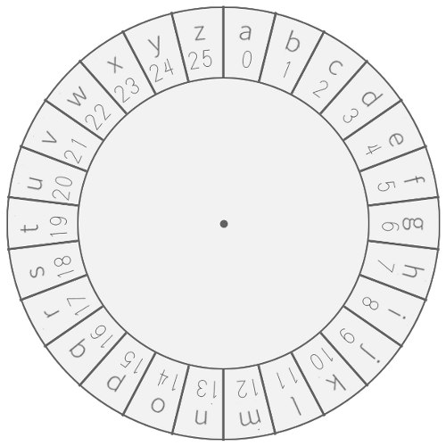
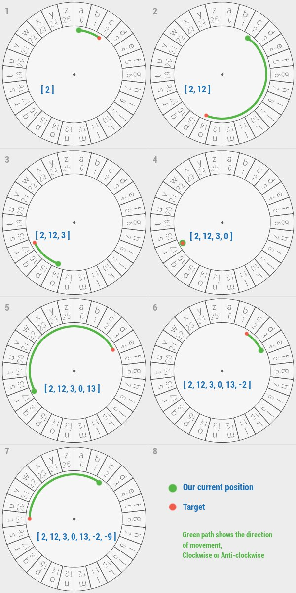

### Problem

Roy's friends has been spying on his text messages, so Roy thought of an algorithm to encrypt text messages.

Encryption Algorithm is as follows: 
We say message to be encrypted as Plain Text and encrypted form of message as Cipher. 
Plain Text consists of <strong>lower case alphabets only</strong>. 
Consider the Cipher Disk as shown in figure.

Initially, we start with <strong>0</strong> (zero). For each character in Plain Text, we move either clockwise or anti-clockwise on the disk depending on which way is closest from where we are currently standing. 
If both clockwise and anti-clockwise distances are equal, we give priority to clockwise movement. 
Clockwise movements are represented using positive numbers while Anti-clockwise movements are represented as negative numbers.

Roy needs your help in implementing this algorithm. Given a Plain Text message, your task is to encrypt it using above algorithm and print the Cipher Text.

<strong>Input:</strong> 
First line contains integer <strong>T</strong> - number of test cases. 
Each of next T lines contains a string representing Plain Text message.

<strong>Output:</strong> 
For each test case, print the encrypted form of given string in new line. 
Each line should consist of space separated integers in the range <strong>[-12,13]</strong>. 
See the sample test case for more clarification.

<strong>Constraints:</strong> 
1 &lt;= <strong>T</strong> &lt;= 100 
1 &lt;= <strong>Length of Plain Text string</strong> &lt;= 100

<strong>Sample Test Case Explanation:</strong> 
Explanation for 3rd sample test case "correct"

<table>
    <thead>
        <th>Sample Input</th>
        <th>Sample Output</th>
    </thead>
    <tbody valign="top">
        <td>3 aeiou hackerearth correct</td>
        <td>0 4 4 6 6 7 -7 2 8 -6 13 13 -4 -9 2 -12 2 12 3 0 13 -2 -9</td>
    </tbody>
</table>

Time Limit: 1 
Memory Limit: 256 
Source Limit:

### Explanation

We begin from 0 (zero) 
1. 'a'-&gt;'c' - two steps clockwise, we reach 'c' 
2. 'c'-&gt;'o' - twelve steps clockwise, we reach 'o' 
3. 'o'-&gt;'r' - three steps clockwise, we reach 'r' 
4. 'r'-&gt;'r' - we are already at 'r', so zero steps 
5. 'r'-&gt;'e' - thirteen steps clockwise, we reach 'e' 
6. 'e'-&gt;'c' - here moving anti-clockwise is optimal, so two steps anticlockwise, and for anticlockwise we add negative sign. 
7. 'c'-&gt;'t' - again anti-clockwise, nine steps.

### Contributers:

<a href="https://www.hackerearth.com/@akatsuki"> Ravi Ojha</a>

<a href="https://www.hackerearth.com/@lalitkundu95"></img> Lalit Kundu</a>
