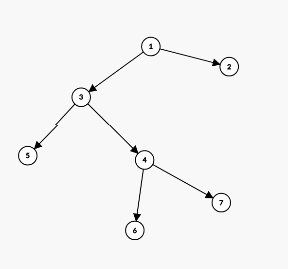

### Problem

You are given a directory tree of <svg width="2.064ex" height="2.009ex" viewBox="0 -748.3 888.5 865.1" role="img" focusable="false" style="vertical-align: -0.271ex;" aria-hidden="true"><defs><path stroke-width="1" id="E37-MJMATHI-4E" d="M234 637Q231 637 226 637Q201 637 196 638T191 649Q191 676 202 682Q204 683 299 683Q376 683 387 683T401 677Q612 181 616 168L670 381Q723 592 723 606Q723 633 659 637Q635 637 635 648Q635 650 637 660Q641 676 643 679T653 683Q656 683 684 682T767 680Q817 680 843 681T873 682Q888 682 888 672Q888 650 880 642Q878 637 858 637Q787 633 769 597L620 7Q618 0 599 0Q585 0 582 2Q579 5 453 305L326 604L261 344Q196 88 196 79Q201 46 268 46H278Q284 41 284 38T282 19Q278 6 272 0H259Q228 2 151 2Q123 2 100 2T63 2T46 1Q31 1 31 10Q31 14 34 26T39 40Q41 46 62 46Q130 49 150 85Q154 91 221 362L289 634Q287 635 234 637Z"></path></defs><g stroke="currentColor" fill="currentColor" stroke-width="0" transform="matrix(1 0 0 -1 0 0)"><use xlink:href="#E37-MJMATHI-4E" x="0" y="0"></use></g></svg> directories/folders. Each directory is represented by a particular <svg width="2.018ex" height="2.143ex" viewBox="0 -805.7 869 922.5" role="img" focusable="false" style="vertical-align: -0.271ex;" aria-hidden="true"><defs><path stroke-width="1" id="E38-MJMATHI-69" d="M184 600Q184 624 203 642T247 661Q265 661 277 649T290 619Q290 596 270 577T226 557Q211 557 198 567T184 600ZM21 287Q21 295 30 318T54 369T98 420T158 442Q197 442 223 419T250 357Q250 340 236 301T196 196T154 83Q149 61 149 51Q149 26 166 26Q175 26 185 29T208 43T235 78T260 137Q263 149 265 151T282 153Q302 153 302 143Q302 135 293 112T268 61T223 11T161 -11Q129 -11 102 10T74 74Q74 91 79 106T122 220Q160 321 166 341T173 380Q173 404 156 404H154Q124 404 99 371T61 287Q60 286 59 284T58 281T56 279T53 278T49 278T41 278H27Q21 284 21 287Z"></path><path stroke-width="1" id="E38-MJMATHI-64" d="M366 683Q367 683 438 688T511 694Q523 694 523 686Q523 679 450 384T375 83T374 68Q374 26 402 26Q411 27 422 35Q443 55 463 131Q469 151 473 152Q475 153 483 153H487H491Q506 153 506 145Q506 140 503 129Q490 79 473 48T445 8T417 -8Q409 -10 393 -10Q359 -10 336 5T306 36L300 51Q299 52 296 50Q294 48 292 46Q233 -10 172 -10Q117 -10 75 30T33 157Q33 205 53 255T101 341Q148 398 195 420T280 442Q336 442 364 400Q369 394 369 396Q370 400 396 505T424 616Q424 629 417 632T378 637H357Q351 643 351 645T353 664Q358 683 366 683ZM352 326Q329 405 277 405Q242 405 210 374T160 293Q131 214 119 129Q119 126 119 118T118 106Q118 61 136 44T179 26Q233 26 290 98L298 109L352 326Z"></path></defs><g stroke="currentColor" fill="currentColor" stroke-width="0" transform="matrix(1 0 0 -1 0 0)"><use xlink:href="#E38-MJMATHI-69" x="0" y="0"></use><use xlink:href="#E38-MJMATHI-64" x="345" y="0"></use></g></svg> which ranges from <svg width="1.162ex" height="2.009ex" viewBox="0 -748.3 500.5 865.1" role="img" focusable="false" style="vertical-align: -0.271ex;" aria-hidden="true"><defs><path stroke-width="1" id="E39-MJMAIN-31" d="M213 578L200 573Q186 568 160 563T102 556H83V602H102Q149 604 189 617T245 641T273 663Q275 666 285 666Q294 666 302 660V361L303 61Q310 54 315 52T339 48T401 46H427V0H416Q395 3 257 3Q121 3 100 0H88V46H114Q136 46 152 46T177 47T193 50T201 52T207 57T213 61V578Z"></path></defs><g stroke="currentColor" fill="currentColor" stroke-width="0" transform="matrix(1 0 0 -1 0 0)"><use xlink:href="#E39-MJMAIN-31" x="0" y="0"></use></g></svg> to <svg width="2.064ex" height="2.009ex" viewBox="0 -748.3 888.5 865.1" role="img" focusable="false" style="vertical-align: -0.271ex;" aria-hidden="true"><defs><path stroke-width="1" id="E40-MJMATHI-4E" d="M234 637Q231 637 226 637Q201 637 196 638T191 649Q191 676 202 682Q204 683 299 683Q376 683 387 683T401 677Q612 181 616 168L670 381Q723 592 723 606Q723 633 659 637Q635 637 635 648Q635 650 637 660Q641 676 643 679T653 683Q656 683 684 682T767 680Q817 680 843 681T873 682Q888 682 888 672Q888 650 880 642Q878 637 858 637Q787 633 769 597L620 7Q618 0 599 0Q585 0 582 2Q579 5 453 305L326 604L261 344Q196 88 196 79Q201 46 268 46H278Q284 41 284 38T282 19Q278 6 272 0H259Q228 2 151 2Q123 2 100 2T63 2T46 1Q31 1 31 10Q31 14 34 26T39 40Q41 46 62 46Q130 49 150 85Q154 91 221 362L289 634Q287 635 234 637Z"></path></defs><g stroke="currentColor" fill="currentColor" stroke-width="0" transform="matrix(1 0 0 -1 0 0)"><use xlink:href="#E40-MJMATHI-4E" x="0" y="0"></use></g></svg>. The id of the root directory is <svg width="1.162ex" height="2.009ex" viewBox="0 -748.3 500.5 865.1" role="img" focusable="false" style="vertical-align: -0.271ex;" aria-hidden="true"><defs><path stroke-width="1" id="E41-MJMAIN-31" d="M213 578L200 573Q186 568 160 563T102 556H83V602H102Q149 604 189 617T245 641T273 663Q275 666 285 666Q294 666 302 660V361L303 61Q310 54 315 52T339 48T401 46H427V0H416Q395 3 257 3Q121 3 100 0H88V46H114Q136 46 152 46T177 47T193 50T201 52T207 57T213 61V578Z"></path></defs><g stroke="currentColor" fill="currentColor" stroke-width="0" transform="matrix(1 0 0 -1 0 0)"><use xlink:href="#E41-MJMAIN-31" x="0" y="0"></use></g></svg>, then it has some child directories, those directories may contain some other ones and it goes on. Now you are given a list of directory id's to delete, you need to find the minimum number of directories that need to be deleted so that all the directories in the given list get deleted.

<strong>Note</strong> that if you delete a particular directory, all its child directories will also get deleted. 
<strong>Input</strong> 
The first line of input contains an integer <svg width="2.064ex" height="2.009ex" viewBox="0 -748.3 888.5 865.1" role="img" focusable="false" style="vertical-align: -0.271ex;" aria-hidden="true"><defs><path stroke-width="1" id="E42-MJMATHI-4E" d="M234 637Q231 637 226 637Q201 637 196 638T191 649Q191 676 202 682Q204 683 299 683Q376 683 387 683T401 677Q612 181 616 168L670 381Q723 592 723 606Q723 633 659 637Q635 637 635 648Q635 650 637 660Q641 676 643 679T653 683Q656 683 684 682T767 680Q817 680 843 681T873 682Q888 682 888 672Q888 650 880 642Q878 637 858 637Q787 633 769 597L620 7Q618 0 599 0Q585 0 582 2Q579 5 453 305L326 604L261 344Q196 88 196 79Q201 46 268 46H278Q284 41 284 38T282 19Q278 6 272 0H259Q228 2 151 2Q123 2 100 2T63 2T46 1Q31 1 31 10Q31 14 34 26T39 40Q41 46 62 46Q130 49 150 85Q154 91 221 362L289 634Q287 635 234 637Z"></path></defs><g stroke="currentColor" fill="currentColor" stroke-width="0" transform="matrix(1 0 0 -1 0 0)"><use xlink:href="#E42-MJMATHI-4E" x="0" y="0"></use></g></svg> that denotes how many folders are there. 
The next line contains <svg width="2.064ex" height="2.009ex" viewBox="0 -748.3 888.5 865.1" role="img" focusable="false" style="vertical-align: -0.271ex;" aria-hidden="true"><defs><path stroke-width="1" id="E43-MJMATHI-4E" d="M234 637Q231 637 226 637Q201 637 196 638T191 649Q191 676 202 682Q204 683 299 683Q376 683 387 683T401 677Q612 181 616 168L670 381Q723 592 723 606Q723 633 659 637Q635 637 635 648Q635 650 637 660Q641 676 643 679T653 683Q656 683 684 682T767 680Q817 680 843 681T873 682Q888 682 888 672Q888 650 880 642Q878 637 858 637Q787 633 769 597L620 7Q618 0 599 0Q585 0 582 2Q579 5 453 305L326 604L261 344Q196 88 196 79Q201 46 268 46H278Q284 41 284 38T282 19Q278 6 272 0H259Q228 2 151 2Q123 2 100 2T63 2T46 1Q31 1 31 10Q31 14 34 26T39 40Q41 46 62 46Q130 49 150 85Q154 91 221 362L289 634Q287 635 234 637Z"></path></defs><g stroke="currentColor" fill="currentColor" stroke-width="0" transform="matrix(1 0 0 -1 0 0)"><use xlink:href="#E43-MJMATHI-4E" x="0" y="0"></use></g></svg> space separated integers that where the <svg width="2.575ex" height="2.409ex" viewBox="0 -920.5 1108.8 1037.3" role="img" focusable="false" style="vertical-align: -0.271ex;" aria-hidden="true"><defs><path stroke-width="1" id="E44-MJMATHI-69" d="M184 600Q184 624 203 642T247 661Q265 661 277 649T290 619Q290 596 270 577T226 557Q211 557 198 567T184 600ZM21 287Q21 295 30 318T54 369T98 420T158 442Q197 442 223 419T250 357Q250 340 236 301T196 196T154 83Q149 61 149 51Q149 26 166 26Q175 26 185 29T208 43T235 78T260 137Q263 149 265 151T282 153Q302 153 302 143Q302 135 293 112T268 61T223 11T161 -11Q129 -11 102 10T74 74Q74 91 79 106T122 220Q160 321 166 341T173 380Q173 404 156 404H154Q124 404 99 371T61 287Q60 286 59 284T58 281T56 279T53 278T49 278T41 278H27Q21 284 21 287Z"></path><path stroke-width="1" id="E44-MJMATHI-74" d="M26 385Q19 392 19 395Q19 399 22 411T27 425Q29 430 36 430T87 431H140L159 511Q162 522 166 540T173 566T179 586T187 603T197 615T211 624T229 626Q247 625 254 615T261 596Q261 589 252 549T232 470L222 433Q222 431 272 431H323Q330 424 330 420Q330 398 317 385H210L174 240Q135 80 135 68Q135 26 162 26Q197 26 230 60T283 144Q285 150 288 151T303 153H307Q322 153 322 145Q322 142 319 133Q314 117 301 95T267 48T216 6T155 -11Q125 -11 98 4T59 56Q57 64 57 83V101L92 241Q127 382 128 383Q128 385 77 385H26Z"></path><path stroke-width="1" id="E44-MJMATHI-68" d="M137 683Q138 683 209 688T282 694Q294 694 294 685Q294 674 258 534Q220 386 220 383Q220 381 227 388Q288 442 357 442Q411 442 444 415T478 336Q478 285 440 178T402 50Q403 36 407 31T422 26Q450 26 474 56T513 138Q516 149 519 151T535 153Q555 153 555 145Q555 144 551 130Q535 71 500 33Q466 -10 419 -10H414Q367 -10 346 17T325 74Q325 90 361 192T398 345Q398 404 354 404H349Q266 404 205 306L198 293L164 158Q132 28 127 16Q114 -11 83 -11Q69 -11 59 -2T48 16Q48 30 121 320L195 616Q195 629 188 632T149 637H128Q122 643 122 645T124 664Q129 683 137 683Z"></path></defs><g stroke="currentColor" fill="currentColor" stroke-width="0" transform="matrix(1 0 0 -1 0 0)"><use xlink:href="#E44-MJMATHI-69" x="0" y="0"></use><g transform="translate(345,362)"><use transform="scale(0.707)" xlink:href="#E44-MJMATHI-74" x="0" y="0"></use><use transform="scale(0.707)" xlink:href="#E44-MJMATHI-68" x="361" y="0"></use></g></g></svg> integer denotes the id of the parent of the directory with id <svg width="0.802ex" height="2.009ex" viewBox="0 -748.3 345.5 865.1" role="img" focusable="false" style="vertical-align: -0.271ex;" aria-hidden="true"><defs><path stroke-width="1" id="E45-MJMATHI-69" d="M184 600Q184 624 203 642T247 661Q265 661 277 649T290 619Q290 596 270 577T226 557Q211 557 198 567T184 600ZM21 287Q21 295 30 318T54 369T98 420T158 442Q197 442 223 419T250 357Q250 340 236 301T196 196T154 83Q149 61 149 51Q149 26 166 26Q175 26 185 29T208 43T235 78T260 137Q263 149 265 151T282 153Q302 153 302 143Q302 135 293 112T268 61T223 11T161 -11Q129 -11 102 10T74 74Q74 91 79 106T122 220Q160 321 166 341T173 380Q173 404 156 404H154Q124 404 99 371T61 287Q60 286 59 284T58 281T56 279T53 278T49 278T41 278H27Q21 284 21 287Z"></path></defs><g stroke="currentColor" fill="currentColor" stroke-width="0" transform="matrix(1 0 0 -1 0 0)"><use xlink:href="#E45-MJMATHI-69" x="0" y="0"></use></g></svg>. Note that the first integer will be <svg width="2.971ex" height="2.143ex" viewBox="0 -748.3 1279 922.5" role="img" focusable="false" style="vertical-align: -0.405ex;" aria-hidden="true"><defs><path stroke-width="1" id="E46-MJMAIN-2212" d="M84 237T84 250T98 270H679Q694 262 694 250T679 230H98Q84 237 84 250Z"></path><path stroke-width="1" id="E46-MJMAIN-31" d="M213 578L200 573Q186 568 160 563T102 556H83V602H102Q149 604 189 617T245 641T273 663Q275 666 285 666Q294 666 302 660V361L303 61Q310 54 315 52T339 48T401 46H427V0H416Q395 3 257 3Q121 3 100 0H88V46H114Q136 46 152 46T177 47T193 50T201 52T207 57T213 61V578Z"></path></defs><g stroke="currentColor" fill="currentColor" stroke-width="0" transform="matrix(1 0 0 -1 0 0)"><use xlink:href="#E46-MJMAIN-2212" x="0" y="0"></use><use xlink:href="#E46-MJMAIN-31" x="778" y="0"></use></g></svg> as <svg width="1.162ex" height="2.009ex" viewBox="0 -748.3 500.5 865.1" role="img" focusable="false" style="vertical-align: -0.271ex;" aria-hidden="true"><defs><path stroke-width="1" id="E47-MJMAIN-31" d="M213 578L200 573Q186 568 160 563T102 556H83V602H102Q149 604 189 617T245 641T273 663Q275 666 285 666Q294 666 302 660V361L303 61Q310 54 315 52T339 48T401 46H427V0H416Q395 3 257 3Q121 3 100 0H88V46H114Q136 46 152 46T177 47T193 50T201 52T207 57T213 61V578Z"></path></defs><g stroke="currentColor" fill="currentColor" stroke-width="0" transform="matrix(1 0 0 -1 0 0)"><use xlink:href="#E47-MJMAIN-31" x="0" y="0"></use></g></svg> is the id of root folder and it has no parent. Rest of the integers will not be <svg width="2.971ex" height="2.143ex" viewBox="0 -748.3 1279 922.5" role="img" focusable="false" style="vertical-align: -0.405ex;" aria-hidden="true"><defs><path stroke-width="1" id="E48-MJMAIN-2212" d="M84 237T84 250T98 270H679Q694 262 694 250T679 230H98Q84 237 84 250Z"></path><path stroke-width="1" id="E48-MJMAIN-31" d="M213 578L200 573Q186 568 160 563T102 556H83V602H102Q149 604 189 617T245 641T273 663Q275 666 285 666Q294 666 302 660V361L303 61Q310 54 315 52T339 48T401 46H427V0H416Q395 3 257 3Q121 3 100 0H88V46H114Q136 46 152 46T177 47T193 50T201 52T207 57T213 61V578Z"></path></defs><g stroke="currentColor" fill="currentColor" stroke-width="0" transform="matrix(1 0 0 -1 0 0)"><use xlink:href="#E48-MJMAIN-2212" x="0" y="0"></use><use xlink:href="#E48-MJMAIN-31" x="778" y="0"></use></g></svg>. 
The next line contains an integer <svg width="2.442ex" height="2.009ex" viewBox="0 -748.3 1051.5 865.1" role="img" focusable="false" style="vertical-align: -0.271ex;" aria-hidden="true"><defs><path stroke-width="1" id="E49-MJMATHI-4D" d="M289 629Q289 635 232 637Q208 637 201 638T194 648Q194 649 196 659Q197 662 198 666T199 671T201 676T203 679T207 681T212 683T220 683T232 684Q238 684 262 684T307 683Q386 683 398 683T414 678Q415 674 451 396L487 117L510 154Q534 190 574 254T662 394Q837 673 839 675Q840 676 842 678T846 681L852 683H948Q965 683 988 683T1017 684Q1051 684 1051 673Q1051 668 1048 656T1045 643Q1041 637 1008 637Q968 636 957 634T939 623Q936 618 867 340T797 59Q797 55 798 54T805 50T822 48T855 46H886Q892 37 892 35Q892 19 885 5Q880 0 869 0Q864 0 828 1T736 2Q675 2 644 2T609 1Q592 1 592 11Q592 13 594 25Q598 41 602 43T625 46Q652 46 685 49Q699 52 704 61Q706 65 742 207T813 490T848 631L654 322Q458 10 453 5Q451 4 449 3Q444 0 433 0Q418 0 415 7Q413 11 374 317L335 624L267 354Q200 88 200 79Q206 46 272 46H282Q288 41 289 37T286 19Q282 3 278 1Q274 0 267 0Q265 0 255 0T221 1T157 2Q127 2 95 1T58 0Q43 0 39 2T35 11Q35 13 38 25T43 40Q45 46 65 46Q135 46 154 86Q158 92 223 354T289 629Z"></path></defs><g stroke="currentColor" fill="currentColor" stroke-width="0" transform="matrix(1 0 0 -1 0 0)"><use xlink:href="#E49-MJMATHI-4D" x="0" y="0"></use></g></svg> that denotes how many directories you need to delete. 
The next line contains <svg width="2.442ex" height="2.009ex" viewBox="0 -748.3 1051.5 865.1" role="img" focusable="false" style="vertical-align: -0.271ex;" aria-hidden="true"><defs><path stroke-width="1" id="E50-MJMATHI-4D" d="M289 629Q289 635 232 637Q208 637 201 638T194 648Q194 649 196 659Q197 662 198 666T199 671T201 676T203 679T207 681T212 683T220 683T232 684Q238 684 262 684T307 683Q386 683 398 683T414 678Q415 674 451 396L487 117L510 154Q534 190 574 254T662 394Q837 673 839 675Q840 676 842 678T846 681L852 683H948Q965 683 988 683T1017 684Q1051 684 1051 673Q1051 668 1048 656T1045 643Q1041 637 1008 637Q968 636 957 634T939 623Q936 618 867 340T797 59Q797 55 798 54T805 50T822 48T855 46H886Q892 37 892 35Q892 19 885 5Q880 0 869 0Q864 0 828 1T736 2Q675 2 644 2T609 1Q592 1 592 11Q592 13 594 25Q598 41 602 43T625 46Q652 46 685 49Q699 52 704 61Q706 65 742 207T813 490T848 631L654 322Q458 10 453 5Q451 4 449 3Q444 0 433 0Q418 0 415 7Q413 11 374 317L335 624L267 354Q200 88 200 79Q206 46 272 46H282Q288 41 289 37T286 19Q282 3 278 1Q274 0 267 0Q265 0 255 0T221 1T157 2Q127 2 95 1T58 0Q43 0 39 2T35 11Q35 13 38 25T43 40Q45 46 65 46Q135 46 154 86Q158 92 223 354T289 629Z"></path></defs><g stroke="currentColor" fill="currentColor" stroke-width="0" transform="matrix(1 0 0 -1 0 0)"><use xlink:href="#E50-MJMATHI-4D" x="0" y="0"></use></g></svg> space separated integers that denote the ids of the directories you need to delete. 
<strong>Output</strong> 
Print the minimum number of directories that need to be deleted.

<strong>Constraints</strong> 
<svg width="12.802ex" height="2.809ex" viewBox="0 -977.9 5512 1209.6" role="img" focusable="false" style="vertical-align: -0.538ex;" aria-hidden="true"><defs><path stroke-width="1" id="E51-MJMAIN-31" d="M213 578L200 573Q186 568 160 563T102 556H83V602H102Q149 604 189 617T245 641T273 663Q275 666 285 666Q294 666 302 660V361L303 61Q310 54 315 52T339 48T401 46H427V0H416Q395 3 257 3Q121 3 100 0H88V46H114Q136 46 152 46T177 47T193 50T201 52T207 57T213 61V578Z"></path><path stroke-width="1" id="E51-MJMAIN-2264" d="M674 636Q682 636 688 630T694 615T687 601Q686 600 417 472L151 346L399 228Q687 92 691 87Q694 81 694 76Q694 58 676 56H670L382 192Q92 329 90 331Q83 336 83 348Q84 359 96 365Q104 369 382 500T665 634Q669 636 674 636ZM84 -118Q84 -108 99 -98H678Q694 -104 694 -118Q694 -130 679 -138H98Q84 -131 84 -118Z"></path><path stroke-width="1" id="E51-MJMATHI-4E" d="M234 637Q231 637 226 637Q201 637 196 638T191 649Q191 676 202 682Q204 683 299 683Q376 683 387 683T401 677Q612 181 616 168L670 381Q723 592 723 606Q723 633 659 637Q635 637 635 648Q635 650 637 660Q641 676 643 679T653 683Q656 683 684 682T767 680Q817 680 843 681T873 682Q888 682 888 672Q888 650 880 642Q878 637 858 637Q787 633 769 597L620 7Q618 0 599 0Q585 0 582 2Q579 5 453 305L326 604L261 344Q196 88 196 79Q201 46 268 46H278Q284 41 284 38T282 19Q278 6 272 0H259Q228 2 151 2Q123 2 100 2T63 2T46 1Q31 1 31 10Q31 14 34 26T39 40Q41 46 62 46Q130 49 150 85Q154 91 221 362L289 634Q287 635 234 637Z"></path><path stroke-width="1" id="E51-MJMAIN-30" d="M96 585Q152 666 249 666Q297 666 345 640T423 548Q460 465 460 320Q460 165 417 83Q397 41 362 16T301 -15T250 -22Q224 -22 198 -16T137 16T82 83Q39 165 39 320Q39 494 96 585ZM321 597Q291 629 250 629Q208 629 178 597Q153 571 145 525T137 333Q137 175 145 125T181 46Q209 16 250 16Q290 16 318 46Q347 76 354 130T362 333Q362 478 354 524T321 597Z"></path><path stroke-width="1" id="E51-MJMAIN-35" d="M164 157Q164 133 148 117T109 101H102Q148 22 224 22Q294 22 326 82Q345 115 345 210Q345 313 318 349Q292 382 260 382H254Q176 382 136 314Q132 307 129 306T114 304Q97 304 95 310Q93 314 93 485V614Q93 664 98 664Q100 666 102 666Q103 666 123 658T178 642T253 634Q324 634 389 662Q397 666 402 666Q410 666 410 648V635Q328 538 205 538Q174 538 149 544L139 546V374Q158 388 169 396T205 412T256 420Q337 420 393 355T449 201Q449 109 385 44T229 -22Q148 -22 99 32T50 154Q50 178 61 192T84 210T107 214Q132 214 148 197T164 157Z"></path></defs><g stroke="currentColor" fill="currentColor" stroke-width="0" transform="matrix(1 0 0 -1 0 0)"><use xlink:href="#E51-MJMAIN-31" x="0" y="0"></use><use xlink:href="#E51-MJMAIN-2264" x="778" y="0"></use><use xlink:href="#E51-MJMATHI-4E" x="1834" y="0"></use><use xlink:href="#E51-MJMAIN-2264" x="3000" y="0"></use><g transform="translate(4057,0)"><use xlink:href="#E51-MJMAIN-31"></use><use xlink:href="#E51-MJMAIN-30" x="500" y="0"></use><use transform="scale(0.707)" xlink:href="#E51-MJMAIN-35" x="1415" y="557"></use></g></g></svg> 
<svg width="21.775ex" height="2.543ex" viewBox="0 -805.7 9375.1 1094.7" role="img" focusable="false" style="vertical-align: -0.671ex;" aria-hidden="true"><defs><path stroke-width="1" id="E52-MJMAIN-31" d="M213 578L200 573Q186 568 160 563T102 556H83V602H102Q149 604 189 617T245 641T273 663Q275 666 285 666Q294 666 302 660V361L303 61Q310 54 315 52T339 48T401 46H427V0H416Q395 3 257 3Q121 3 100 0H88V46H114Q136 46 152 46T177 47T193 50T201 52T207 57T213 61V578Z"></path><path stroke-width="1" id="E52-MJMAIN-2264" d="M674 636Q682 636 688 630T694 615T687 601Q686 600 417 472L151 346L399 228Q687 92 691 87Q694 81 694 76Q694 58 676 56H670L382 192Q92 329 90 331Q83 336 83 348Q84 359 96 365Q104 369 382 500T665 634Q669 636 674 636ZM84 -118Q84 -108 99 -98H678Q694 -104 694 -118Q694 -130 679 -138H98Q84 -131 84 -118Z"></path><path stroke-width="1" id="E52-MJMATHI-69" d="M184 600Q184 624 203 642T247 661Q265 661 277 649T290 619Q290 596 270 577T226 557Q211 557 198 567T184 600ZM21 287Q21 295 30 318T54 369T98 420T158 442Q197 442 223 419T250 357Q250 340 236 301T196 196T154 83Q149 61 149 51Q149 26 166 26Q175 26 185 29T208 43T235 78T260 137Q263 149 265 151T282 153Q302 153 302 143Q302 135 293 112T268 61T223 11T161 -11Q129 -11 102 10T74 74Q74 91 79 106T122 220Q160 321 166 341T173 380Q173 404 156 404H154Q124 404 99 371T61 287Q60 286 59 284T58 281T56 279T53 278T49 278T41 278H27Q21 284 21 287Z"></path><path stroke-width="1" id="E52-MJMATHI-64" d="M366 683Q367 683 438 688T511 694Q523 694 523 686Q523 679 450 384T375 83T374 68Q374 26 402 26Q411 27 422 35Q443 55 463 131Q469 151 473 152Q475 153 483 153H487H491Q506 153 506 145Q506 140 503 129Q490 79 473 48T445 8T417 -8Q409 -10 393 -10Q359 -10 336 5T306 36L300 51Q299 52 296 50Q294 48 292 46Q233 -10 172 -10Q117 -10 75 30T33 157Q33 205 53 255T101 341Q148 398 195 420T280 442Q336 442 364 400Q369 394 369 396Q370 400 396 505T424 616Q424 629 417 632T378 637H357Q351 643 351 645T353 664Q358 683 366 683ZM352 326Q329 405 277 405Q242 405 210 374T160 293Q131 214 119 129Q119 126 119 118T118 106Q118 61 136 44T179 26Q233 26 290 98L298 109L352 326Z"></path><path stroke-width="1" id="E52-MJMATHI-6F" d="M201 -11Q126 -11 80 38T34 156Q34 221 64 279T146 380Q222 441 301 441Q333 441 341 440Q354 437 367 433T402 417T438 387T464 338T476 268Q476 161 390 75T201 -11ZM121 120Q121 70 147 48T206 26Q250 26 289 58T351 142Q360 163 374 216T388 308Q388 352 370 375Q346 405 306 405Q243 405 195 347Q158 303 140 230T121 120Z"></path><path stroke-width="1" id="E52-MJMATHI-66" d="M118 -162Q120 -162 124 -164T135 -167T147 -168Q160 -168 171 -155T187 -126Q197 -99 221 27T267 267T289 382V385H242Q195 385 192 387Q188 390 188 397L195 425Q197 430 203 430T250 431Q298 431 298 432Q298 434 307 482T319 540Q356 705 465 705Q502 703 526 683T550 630Q550 594 529 578T487 561Q443 561 443 603Q443 622 454 636T478 657L487 662Q471 668 457 668Q445 668 434 658T419 630Q412 601 403 552T387 469T380 433Q380 431 435 431Q480 431 487 430T498 424Q499 420 496 407T491 391Q489 386 482 386T428 385H372L349 263Q301 15 282 -47Q255 -132 212 -173Q175 -205 139 -205Q107 -205 81 -186T55 -132Q55 -95 76 -78T118 -61Q162 -61 162 -103Q162 -122 151 -136T127 -157L118 -162Z"></path><path stroke-width="1" id="E52-MJMATHI-70" d="M23 287Q24 290 25 295T30 317T40 348T55 381T75 411T101 433T134 442Q209 442 230 378L240 387Q302 442 358 442Q423 442 460 395T497 281Q497 173 421 82T249 -10Q227 -10 210 -4Q199 1 187 11T168 28L161 36Q160 35 139 -51T118 -138Q118 -144 126 -145T163 -148H188Q194 -155 194 -157T191 -175Q188 -187 185 -190T172 -194Q170 -194 161 -194T127 -193T65 -192Q-5 -192 -24 -194H-32Q-39 -187 -39 -183Q-37 -156 -26 -148H-6Q28 -147 33 -136Q36 -130 94 103T155 350Q156 355 156 364Q156 405 131 405Q109 405 94 377T71 316T59 280Q57 278 43 278H29Q23 284 23 287ZM178 102Q200 26 252 26Q282 26 310 49T356 107Q374 141 392 215T411 325V331Q411 405 350 405Q339 405 328 402T306 393T286 380T269 365T254 350T243 336T235 326L232 322Q232 321 229 308T218 264T204 212Q178 106 178 102Z"></path><path stroke-width="1" id="E52-MJMATHI-61" d="M33 157Q33 258 109 349T280 441Q331 441 370 392Q386 422 416 422Q429 422 439 414T449 394Q449 381 412 234T374 68Q374 43 381 35T402 26Q411 27 422 35Q443 55 463 131Q469 151 473 152Q475 153 483 153H487Q506 153 506 144Q506 138 501 117T481 63T449 13Q436 0 417 -8Q409 -10 393 -10Q359 -10 336 5T306 36L300 51Q299 52 296 50Q294 48 292 46Q233 -10 172 -10Q117 -10 75 30T33 157ZM351 328Q351 334 346 350T323 385T277 405Q242 405 210 374T160 293Q131 214 119 129Q119 126 119 118T118 106Q118 61 136 44T179 26Q217 26 254 59T298 110Q300 114 325 217T351 328Z"></path><path stroke-width="1" id="E52-MJMATHI-72" d="M21 287Q22 290 23 295T28 317T38 348T53 381T73 411T99 433T132 442Q161 442 183 430T214 408T225 388Q227 382 228 382T236 389Q284 441 347 441H350Q398 441 422 400Q430 381 430 363Q430 333 417 315T391 292T366 288Q346 288 334 299T322 328Q322 376 378 392Q356 405 342 405Q286 405 239 331Q229 315 224 298T190 165Q156 25 151 16Q138 -11 108 -11Q95 -11 87 -5T76 7T74 17Q74 30 114 189T154 366Q154 405 128 405Q107 405 92 377T68 316T57 280Q55 278 41 278H27Q21 284 21 287Z"></path><path stroke-width="1" id="E52-MJMATHI-65" d="M39 168Q39 225 58 272T107 350T174 402T244 433T307 442H310Q355 442 388 420T421 355Q421 265 310 237Q261 224 176 223Q139 223 138 221Q138 219 132 186T125 128Q125 81 146 54T209 26T302 45T394 111Q403 121 406 121Q410 121 419 112T429 98T420 82T390 55T344 24T281 -1T205 -11Q126 -11 83 42T39 168ZM373 353Q367 405 305 405Q272 405 244 391T199 357T170 316T154 280T149 261Q149 260 169 260Q282 260 327 284T373 353Z"></path><path stroke-width="1" id="E52-MJMATHI-6E" d="M21 287Q22 293 24 303T36 341T56 388T89 425T135 442Q171 442 195 424T225 390T231 369Q231 367 232 367L243 378Q304 442 382 442Q436 442 469 415T503 336T465 179T427 52Q427 26 444 26Q450 26 453 27Q482 32 505 65T540 145Q542 153 560 153Q580 153 580 145Q580 144 576 130Q568 101 554 73T508 17T439 -10Q392 -10 371 17T350 73Q350 92 386 193T423 345Q423 404 379 404H374Q288 404 229 303L222 291L189 157Q156 26 151 16Q138 -11 108 -11Q95 -11 87 -5T76 7T74 17Q74 30 112 180T152 343Q153 348 153 366Q153 405 129 405Q91 405 66 305Q60 285 60 284Q58 278 41 278H27Q21 284 21 287Z"></path><path stroke-width="1" id="E52-MJMATHI-74" d="M26 385Q19 392 19 395Q19 399 22 411T27 425Q29 430 36 430T87 431H140L159 511Q162 522 166 540T173 566T179 586T187 603T197 615T211 624T229 626Q247 625 254 615T261 596Q261 589 252 549T232 470L222 433Q222 431 272 431H323Q330 424 330 420Q330 398 317 385H210L174 240Q135 80 135 68Q135 26 162 26Q197 26 230 60T283 144Q285 150 288 151T303 153H307Q322 153 322 145Q322 142 319 133Q314 117 301 95T267 48T216 6T155 -11Q125 -11 98 4T59 56Q57 64 57 83V101L92 241Q127 382 128 383Q128 385 77 385H26Z"></path><path stroke-width="1" id="E52-MJMATHI-4E" d="M234 637Q231 637 226 637Q201 637 196 638T191 649Q191 676 202 682Q204 683 299 683Q376 683 387 683T401 677Q612 181 616 168L670 381Q723 592 723 606Q723 633 659 637Q635 637 635 648Q635 650 637 660Q641 676 643 679T653 683Q656 683 684 682T767 680Q817 680 843 681T873 682Q888 682 888 672Q888 650 880 642Q878 637 858 637Q787 633 769 597L620 7Q618 0 599 0Q585 0 582 2Q579 5 453 305L326 604L261 344Q196 88 196 79Q201 46 268 46H278Q284 41 284 38T282 19Q278 6 272 0H259Q228 2 151 2Q123 2 100 2T63 2T46 1Q31 1 31 10Q31 14 34 26T39 40Q41 46 62 46Q130 49 150 85Q154 91 221 362L289 634Q287 635 234 637Z"></path></defs><g stroke="currentColor" fill="currentColor" stroke-width="0" transform="matrix(1 0 0 -1 0 0)"><use xlink:href="#E52-MJMAIN-31" x="0" y="0"></use><use xlink:href="#E52-MJMAIN-2264" x="778" y="0"></use><use xlink:href="#E52-MJMATHI-69" x="1834" y="0"></use><use xlink:href="#E52-MJMATHI-64" x="2180" y="0"></use><use xlink:href="#E52-MJMATHI-6F" x="2953" y="0"></use><use xlink:href="#E52-MJMATHI-66" x="3439" y="0"></use><use xlink:href="#E52-MJMATHI-70" x="4239" y="0"></use><use xlink:href="#E52-MJMATHI-61" x="4743" y="0"></use><use xlink:href="#E52-MJMATHI-72" x="5272" y="0"></use><use xlink:href="#E52-MJMATHI-65" x="5724" y="0"></use><use xlink:href="#E52-MJMATHI-6E" x="6190" y="0"></use><use xlink:href="#E52-MJMATHI-74" x="6791" y="0"></use><use xlink:href="#E52-MJMAIN-2264" x="7430" y="0"></use><use xlink:href="#E52-MJMATHI-4E" x="8486" y="0"></use></g></svg> 
<svg width="11.865ex" height="2.276ex" viewBox="0 -748.3 5108.6 979.9" role="img" focusable="false" style="vertical-align: -0.538ex;" aria-hidden="true"><defs><path stroke-width="1" id="E53-MJMAIN-31" d="M213 578L200 573Q186 568 160 563T102 556H83V602H102Q149 604 189 617T245 641T273 663Q275 666 285 666Q294 666 302 660V361L303 61Q310 54 315 52T339 48T401 46H427V0H416Q395 3 257 3Q121 3 100 0H88V46H114Q136 46 152 46T177 47T193 50T201 52T207 57T213 61V578Z"></path><path stroke-width="1" id="E53-MJMAIN-2264" d="M674 636Q682 636 688 630T694 615T687 601Q686 600 417 472L151 346L399 228Q687 92 691 87Q694 81 694 76Q694 58 676 56H670L382 192Q92 329 90 331Q83 336 83 348Q84 359 96 365Q104 369 382 500T665 634Q669 636 674 636ZM84 -118Q84 -108 99 -98H678Q694 -104 694 -118Q694 -130 679 -138H98Q84 -131 84 -118Z"></path><path stroke-width="1" id="E53-MJMATHI-4D" d="M289 629Q289 635 232 637Q208 637 201 638T194 648Q194 649 196 659Q197 662 198 666T199 671T201 676T203 679T207 681T212 683T220 683T232 684Q238 684 262 684T307 683Q386 683 398 683T414 678Q415 674 451 396L487 117L510 154Q534 190 574 254T662 394Q837 673 839 675Q840 676 842 678T846 681L852 683H948Q965 683 988 683T1017 684Q1051 684 1051 673Q1051 668 1048 656T1045 643Q1041 637 1008 637Q968 636 957 634T939 623Q936 618 867 340T797 59Q797 55 798 54T805 50T822 48T855 46H886Q892 37 892 35Q892 19 885 5Q880 0 869 0Q864 0 828 1T736 2Q675 2 644 2T609 1Q592 1 592 11Q592 13 594 25Q598 41 602 43T625 46Q652 46 685 49Q699 52 704 61Q706 65 742 207T813 490T848 631L654 322Q458 10 453 5Q451 4 449 3Q444 0 433 0Q418 0 415 7Q413 11 374 317L335 624L267 354Q200 88 200 79Q206 46 272 46H282Q288 41 289 37T286 19Q282 3 278 1Q274 0 267 0Q265 0 255 0T221 1T157 2Q127 2 95 1T58 0Q43 0 39 2T35 11Q35 13 38 25T43 40Q45 46 65 46Q135 46 154 86Q158 92 223 354T289 629Z"></path><path stroke-width="1" id="E53-MJMATHI-4E" d="M234 637Q231 637 226 637Q201 637 196 638T191 649Q191 676 202 682Q204 683 299 683Q376 683 387 683T401 677Q612 181 616 168L670 381Q723 592 723 606Q723 633 659 637Q635 637 635 648Q635 650 637 660Q641 676 643 679T653 683Q656 683 684 682T767 680Q817 680 843 681T873 682Q888 682 888 672Q888 650 880 642Q878 637 858 637Q787 633 769 597L620 7Q618 0 599 0Q585 0 582 2Q579 5 453 305L326 604L261 344Q196 88 196 79Q201 46 268 46H278Q284 41 284 38T282 19Q278 6 272 0H259Q228 2 151 2Q123 2 100 2T63 2T46 1Q31 1 31 10Q31 14 34 26T39 40Q41 46 62 46Q130 49 150 85Q154 91 221 362L289 634Q287 635 234 637Z"></path></defs><g stroke="currentColor" fill="currentColor" stroke-width="0" transform="matrix(1 0 0 -1 0 0)"><use xlink:href="#E53-MJMAIN-31" x="0" y="0"></use><use xlink:href="#E53-MJMAIN-2264" x="778" y="0"></use><use xlink:href="#E53-MJMATHI-4D" x="1834" y="0"></use><use xlink:href="#E53-MJMAIN-2264" x="3163" y="0"></use><use xlink:href="#E53-MJMATHI-4E" x="4220" y="0"></use></g></svg> 
<svg width="24.447ex" height="2.409ex" viewBox="0 -805.7 10525.6 1037.3" role="img" focusable="false" style="vertical-align: -0.538ex;" aria-hidden="true"><defs><path stroke-width="1" id="E54-MJMAIN-31" d="M213 578L200 573Q186 568 160 563T102 556H83V602H102Q149 604 189 617T245 641T273 663Q275 666 285 666Q294 666 302 660V361L303 61Q310 54 315 52T339 48T401 46H427V0H416Q395 3 257 3Q121 3 100 0H88V46H114Q136 46 152 46T177 47T193 50T201 52T207 57T213 61V578Z"></path><path stroke-width="1" id="E54-MJMAIN-2264" d="M674 636Q682 636 688 630T694 615T687 601Q686 600 417 472L151 346L399 228Q687 92 691 87Q694 81 694 76Q694 58 676 56H670L382 192Q92 329 90 331Q83 336 83 348Q84 359 96 365Q104 369 382 500T665 634Q669 636 674 636ZM84 -118Q84 -108 99 -98H678Q694 -104 694 -118Q694 -130 679 -138H98Q84 -131 84 -118Z"></path><path stroke-width="1" id="E54-MJMATHI-69" d="M184 600Q184 624 203 642T247 661Q265 661 277 649T290 619Q290 596 270 577T226 557Q211 557 198 567T184 600ZM21 287Q21 295 30 318T54 369T98 420T158 442Q197 442 223 419T250 357Q250 340 236 301T196 196T154 83Q149 61 149 51Q149 26 166 26Q175 26 185 29T208 43T235 78T260 137Q263 149 265 151T282 153Q302 153 302 143Q302 135 293 112T268 61T223 11T161 -11Q129 -11 102 10T74 74Q74 91 79 106T122 220Q160 321 166 341T173 380Q173 404 156 404H154Q124 404 99 371T61 287Q60 286 59 284T58 281T56 279T53 278T49 278T41 278H27Q21 284 21 287Z"></path><path stroke-width="1" id="E54-MJMATHI-64" d="M366 683Q367 683 438 688T511 694Q523 694 523 686Q523 679 450 384T375 83T374 68Q374 26 402 26Q411 27 422 35Q443 55 463 131Q469 151 473 152Q475 153 483 153H487H491Q506 153 506 145Q506 140 503 129Q490 79 473 48T445 8T417 -8Q409 -10 393 -10Q359 -10 336 5T306 36L300 51Q299 52 296 50Q294 48 292 46Q233 -10 172 -10Q117 -10 75 30T33 157Q33 205 53 255T101 341Q148 398 195 420T280 442Q336 442 364 400Q369 394 369 396Q370 400 396 505T424 616Q424 629 417 632T378 637H357Q351 643 351 645T353 664Q358 683 366 683ZM352 326Q329 405 277 405Q242 405 210 374T160 293Q131 214 119 129Q119 126 119 118T118 106Q118 61 136 44T179 26Q233 26 290 98L298 109L352 326Z"></path><path stroke-width="1" id="E54-MJMATHI-74" d="M26 385Q19 392 19 395Q19 399 22 411T27 425Q29 430 36 430T87 431H140L159 511Q162 522 166 540T173 566T179 586T187 603T197 615T211 624T229 626Q247 625 254 615T261 596Q261 589 252 549T232 470L222 433Q222 431 272 431H323Q330 424 330 420Q330 398 317 385H210L174 240Q135 80 135 68Q135 26 162 26Q197 26 230 60T283 144Q285 150 288 151T303 153H307Q322 153 322 145Q322 142 319 133Q314 117 301 95T267 48T216 6T155 -11Q125 -11 98 4T59 56Q57 64 57 83V101L92 241Q127 382 128 383Q128 385 77 385H26Z"></path><path stroke-width="1" id="E54-MJMATHI-6F" d="M201 -11Q126 -11 80 38T34 156Q34 221 64 279T146 380Q222 441 301 441Q333 441 341 440Q354 437 367 433T402 417T438 387T464 338T476 268Q476 161 390 75T201 -11ZM121 120Q121 70 147 48T206 26Q250 26 289 58T351 142Q360 163 374 216T388 308Q388 352 370 375Q346 405 306 405Q243 405 195 347Q158 303 140 230T121 120Z"></path><path stroke-width="1" id="E54-MJMATHI-62" d="M73 647Q73 657 77 670T89 683Q90 683 161 688T234 694Q246 694 246 685T212 542Q204 508 195 472T180 418L176 399Q176 396 182 402Q231 442 283 442Q345 442 383 396T422 280Q422 169 343 79T173 -11Q123 -11 82 27T40 150V159Q40 180 48 217T97 414Q147 611 147 623T109 637Q104 637 101 637H96Q86 637 83 637T76 640T73 647ZM336 325V331Q336 405 275 405Q258 405 240 397T207 376T181 352T163 330L157 322L136 236Q114 150 114 114Q114 66 138 42Q154 26 178 26Q211 26 245 58Q270 81 285 114T318 219Q336 291 336 325Z"></path><path stroke-width="1" id="E54-MJMATHI-65" d="M39 168Q39 225 58 272T107 350T174 402T244 433T307 442H310Q355 442 388 420T421 355Q421 265 310 237Q261 224 176 223Q139 223 138 221Q138 219 132 186T125 128Q125 81 146 54T209 26T302 45T394 111Q403 121 406 121Q410 121 419 112T429 98T420 82T390 55T344 24T281 -1T205 -11Q126 -11 83 42T39 168ZM373 353Q367 405 305 405Q272 405 244 391T199 357T170 316T154 280T149 261Q149 260 169 260Q282 260 327 284T373 353Z"></path><path stroke-width="1" id="E54-MJMATHI-6C" d="M117 59Q117 26 142 26Q179 26 205 131Q211 151 215 152Q217 153 225 153H229Q238 153 241 153T246 151T248 144Q247 138 245 128T234 90T214 43T183 6T137 -11Q101 -11 70 11T38 85Q38 97 39 102L104 360Q167 615 167 623Q167 626 166 628T162 632T157 634T149 635T141 636T132 637T122 637Q112 637 109 637T101 638T95 641T94 647Q94 649 96 661Q101 680 107 682T179 688Q194 689 213 690T243 693T254 694Q266 694 266 686Q266 675 193 386T118 83Q118 81 118 75T117 65V59Z"></path><path stroke-width="1" id="E54-MJMATHI-4E" d="M234 637Q231 637 226 637Q201 637 196 638T191 649Q191 676 202 682Q204 683 299 683Q376 683 387 683T401 677Q612 181 616 168L670 381Q723 592 723 606Q723 633 659 637Q635 637 635 648Q635 650 637 660Q641 676 643 679T653 683Q656 683 684 682T767 680Q817 680 843 681T873 682Q888 682 888 672Q888 650 880 642Q878 637 858 637Q787 633 769 597L620 7Q618 0 599 0Q585 0 582 2Q579 5 453 305L326 604L261 344Q196 88 196 79Q201 46 268 46H278Q284 41 284 38T282 19Q278 6 272 0H259Q228 2 151 2Q123 2 100 2T63 2T46 1Q31 1 31 10Q31 14 34 26T39 40Q41 46 62 46Q130 49 150 85Q154 91 221 362L289 634Q287 635 234 637Z"></path></defs><g stroke="currentColor" fill="currentColor" stroke-width="0" transform="matrix(1 0 0 -1 0 0)"><use xlink:href="#E54-MJMAIN-31" x="0" y="0"></use><use xlink:href="#E54-MJMAIN-2264" x="778" y="0"></use><use xlink:href="#E54-MJMATHI-69" x="1834" y="0"></use><use xlink:href="#E54-MJMATHI-64" x="2180" y="0"></use><use xlink:href="#E54-MJMATHI-74" x="2953" y="0"></use><use xlink:href="#E54-MJMATHI-6F" x="3315" y="0"></use><use xlink:href="#E54-MJMATHI-62" x="4050" y="0"></use><use xlink:href="#E54-MJMATHI-65" x="4480" y="0"></use><use xlink:href="#E54-MJMATHI-64" x="5196" y="0"></use><use xlink:href="#E54-MJMATHI-65" x="5720" y="0"></use><use xlink:href="#E54-MJMATHI-6C" x="6186" y="0"></use><use xlink:href="#E54-MJMATHI-65" x="6485" y="0"></use><use xlink:href="#E54-MJMATHI-74" x="6951" y="0"></use><use xlink:href="#E54-MJMATHI-65" x="7313" y="0"></use><use xlink:href="#E54-MJMATHI-64" x="7779" y="0"></use><use xlink:href="#E54-MJMAIN-2264" x="8580" y="0"></use><use xlink:href="#E54-MJMATHI-4E" x="9637" y="0"></use></g></svg>

<table>
  <thead>
    <th>Sample Input</th>
    <th>Sample Output</th>
  </thead>
  <tbody valign="top">
    <td>7 -1 1 1 3 3 4 4 3 2 3 4</td>
    <td>2</td>
  </tbody>
</table>

Time Limit: 2 
Memory Limit: 256 
Source Limit:

### Explanation

In the image below is the complete directory tree. If you delete the directories 2 and 3, 4 gets automatically deleted, thus you need to delete only 2 directories.

Designed in Csacademy graph creator

### Contributers:

<a href="https://www.hackerearth.com/@appticav2"> Saurabh Joshi</a>

<a href="https://www.hackerearth.com/@akash.sharma"> Akash Sharma</a>
