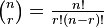

This problem is related to DP, Probability and Combinatorics
Let's define C(n,r) =

So the answer for fixed k: C(m,k) * C(s-m,n-k) / C(s,n). According to this formula, to calculate fast, you have to P(i,j) (for all i and j) initially. And If you use Big Numbers in Java then you get TLE. So prevent TLE you have to take logarithm from both sides, then you get small double number. After that we can simply take exponential of that formula. That's the answer.

### Author's Solution

<pre><code>#include &lt;cstdio&gt;
#include &lt;algorithm&gt;

using namespace std;

#define MAX 1001

double p[MAX][MAX];
int S, N, M, K;

void print(int l){
    for(int i=0;i&lt;=l;i++){
		for(int j=0;j&lt;=l;j++)
			printf("%lf ", p[i][j]);
		printf("\n");
	}
}

void solve(){
	for(int i=0;i&lt;MAX;i++)
		for(int j=0;j&lt;MAX;j++)
			p[i][j] = 0.0;
	p[0][0] = 1.0;
	for(int i=1;i&lt;=N;i++){
		if(S-M-i+1&gt;0 and S-i+1&gt;0){
			p[0][i] = p[0][i-1]*((double)(S-M-i+1)/(double)(S-i+1));
			if(p[0][i]&lt;0.0)
				p[0][i] = 0.0;
		}else
			p[0][i] = 0.0;
	}
	for(int i=1;i&lt;=M;i++){
		for(int j=1;j&lt;=N;j++){
			//if(M-i+1&gt;0 and S-j+1&gt;0 and S-M-j+i&gt;0 and S-j+1&gt;0){
				p[i][j] = p[i-1][j-1]*((double)(M-i+1)/(double)(S-j+1)) + p[i][j-1]*((double)(S-M-j+1+i)/(double)(S-j+1));
				if(p[i][j]&lt;0.0)
					p[i][j] = 0.0;
			//}else
			//	p[i][j] = 0.0;
		}
	}
	//print(N);
	double ans = 0.0;
	for(int i=K;i&lt;=M;i++)
	//for(int i=0;i&lt;K;i++)
		ans = ans + p[i][N];
	//printf("%lf\n", 1.0-ans);
	printf("%lf\n", ans);

}
int main(){
	int T;
	scanf("%d", &amp;T);
	while(T--){
		scanf("%d %d %d %d", &amp;S, &amp;N, &amp;M, &amp;K);
		solve();
	}
}</code></pre>

### Tester's Solution

<pre><code>#include &lt;cstdio&gt;
#include &lt;algorithm&gt;

using namespace std;

#define MAX 1001

double p[MAX][MAX];
int S, N, M, K;

void print(int l){
    for(int i=0;i&lt;=l;i++){
		for(int j=0;j&lt;=l;j++)
			printf("%lf ", p[i][j]);
		printf("\n");
	}
}

void solve(){
	for(int i=0;i&lt;MAX;i++)
		for(int j=0;j&lt;MAX;j++)
			p[i][j] = 0.0;
	p[0][0] = 1.0;
	for(int i=1;i&lt;=N;i++){
		if(S-M-i+1&gt;0 and S-i+1&gt;0){
			p[0][i] = p[0][i-1]*((double)(S-M-i+1)/(double)(S-i+1));
			if(p[0][i]&lt;0.0)
				p[0][i] = 0.0;
		}else
			p[0][i] = 0.0;
	}
	for(int i=1;i&lt;=M;i++){
		for(int j=1;j&lt;=N;j++){
			//if(M-i+1&gt;0 and S-j+1&gt;0 and S-M-j+i&gt;0 and S-j+1&gt;0){
				p[i][j] = p[i-1][j-1]*((double)(M-i+1)/(double)(S-j+1)) + p[i][j-1]*((double)(S-M-j+1+i)/(double)(S-j+1));
				if(p[i][j]&lt;0.0)
					p[i][j] = 0.0;
			//}else
			//	p[i][j] = 0.0;
		}
	}
	//print(N);
	double ans = 0.0;
	for(int i=K;i&lt;=M;i++)
	//for(int i=0;i&lt;K;i++)
		ans = ans + p[i][N];
	//printf("%lf\n", 1.0-ans);
	printf("%lf\n", ans);

}
int main(){
	int T;
	scanf("%d", &amp;T);
	while(T--){
		scanf("%d %d %d %d", &amp;S, &amp;N, &amp;M, &amp;K);
		solve();
	}
}</code></pre>